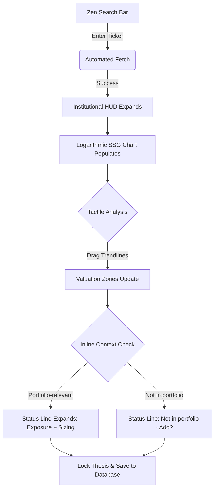
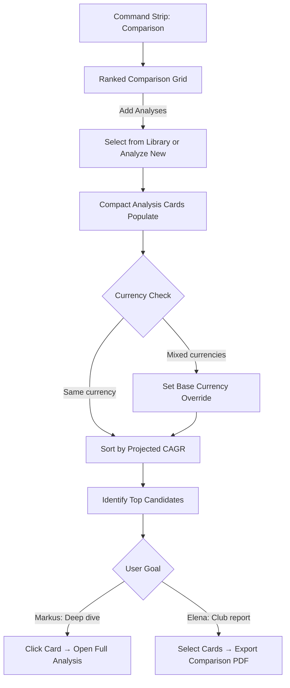
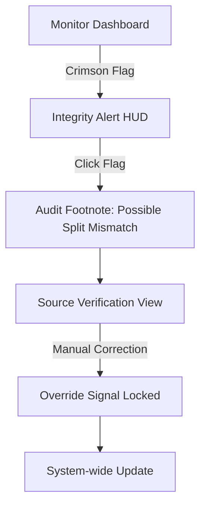
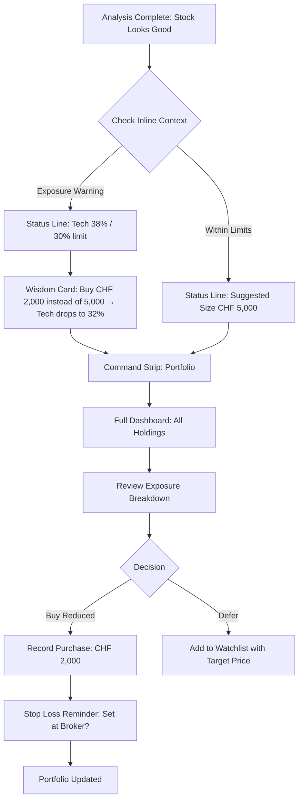
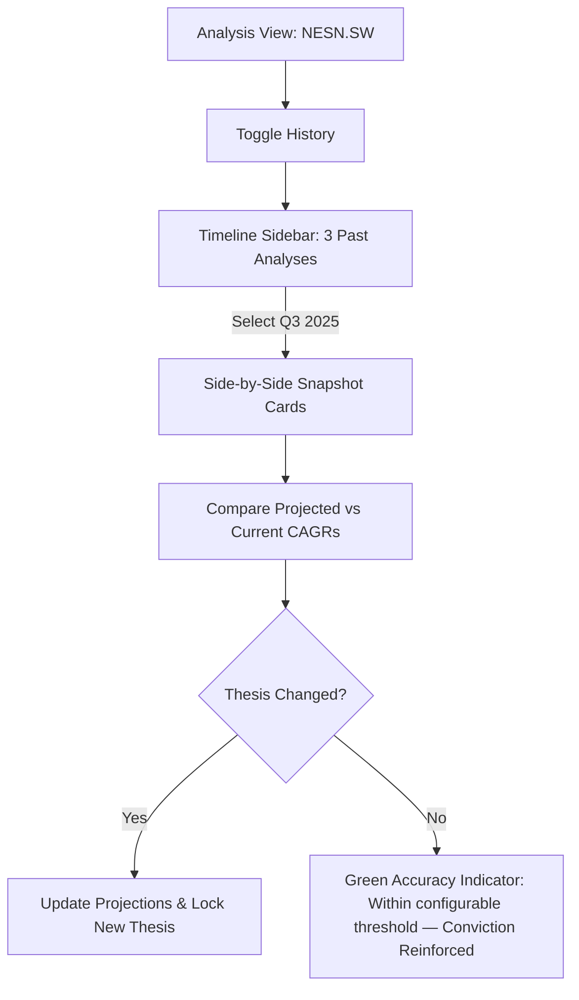
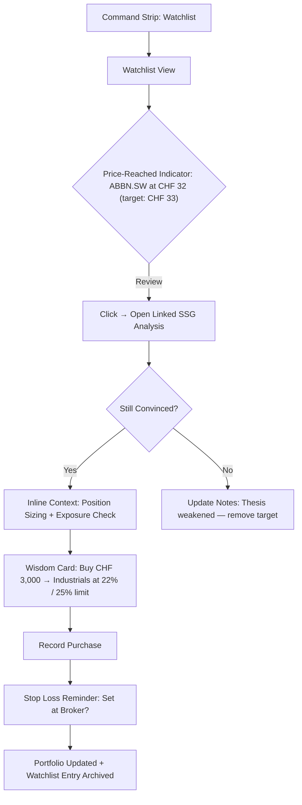

# UX Design Specification SteadyInvest

**Author:** Guy
**Date:** 2026-02-04
**Last Revised:** 2026-02-10

---

## Executive Summary

### Project Vision

**SteadyInvest** is an open-source investment analysis and portfolio management platform built on the NAIC Stock Selection Guide (SSG) methodology. The platform addresses three moments in the investment lifecycle:

1. **Analyze** — The SSG chart tells you *what* to buy and at *what price* (delivered in MVP).
2. **Buy Smart** — Position sizing tells you *how much* to buy; stop loss reminders tell you *how to protect it*.
3. **Stay Balanced** — Exposure checks tell you *when to rebalance* your portfolio.

The MVP delivers automated "One-Click History" for Swiss, German, and US markets with web-native logarithmic charting, quality dashboards, kinetic projection manipulation, thesis locking, and PDF export. The platform evolves from an analysis tool into a practical investment management platform with database-persisted analyses, portfolio tracking with risk discipline, watchlists, and multi-user support.

### Target Users

* **Primary (Markus — The Value Hunter)**: Experienced or beginner analysts who research 5–20 stocks per week. Markus operates in two distinct modes that the UX must serve independently:
  * **Researcher Mode**: Searching tickers, populating charts, manipulating projections, comparing analyses across multiple stocks — focused on discovery and selection.
  * **Risk Manager Mode**: Reviewing portfolio exposure, sizing new positions, setting stop loss reminders, checking diversification — focused on discipline and protection.
* **Secondary (Elena — The Club Moderator)**: Investment club members who require standardized, professional-grade reports and shared analysis libraries for collaborative decision-making.
* **Admin (David — The Data Steward)**: Monitors the data engine's health to ensure continuous, reliable automation.

### Key Design Challenges

* **Density vs. Clarity**: Balancing high-density financial ratios with a clean, focused interface that avoids overwhelming the user — now across more views (analysis, comparison, portfolio, watchlist).
* **Tactile Charting**: Delivering a highly interactive, logarithmic projection tool in a web-native (WASM) environment that feels responsive and intuitive.
* **Multi-Stock Comparison at Scale**: Displaying compact projected performance metrics for 5–20 tickers in a ranked list or grid layout — a fundamentally different pattern from the MVP's dual-canvas "Peer Duel," which it replaces. Must handle mixed-currency monetary values alongside currency-agnostic percentages.
* **Decision-Time Discipline**: Surfacing portfolio alerts (over-exposure, position sizing) precisely when the user is about to act (buy/rebalance). The emotional goal is *wisdom, not warning* — the system should feel like a trusted advisor tapping your shoulder, not a nagging gatekeeper. Getting the tone, timing, and visual weight right is critical to building trust.
* **Analysis Library Navigation**: Enabling retrieval and comparison of past analyses to track thesis evolution over time.

### Design Opportunities

* **The "Aha!" Moment**: Instantaneous population of a 10-year growth chart from a single ticker entry, providing immediate value.
* **Projection Shadows**: Using ghosted historical slopes as a visual anchor when users make future growth projections.
* **The Command Strip**: A persistent, slim sidebar anchoring the expanded workflow — now spanning Analysis, Comparison, Portfolio, and Watchlist modes.
* **Comparison Dashboard**: Compact analysis cards in a ranked grid that let investors compare and select across multiple tickers at a glance, with smart currency handling.

## Core User Experience

### Defining Experience

The defining experience of **SteadyInvest** spans two phases of the investment lifecycle, delivered as a web-native SPA built with Rust (Leptos) for high-performance WASM charting — desktop-first for deep analytical work, with a mobile "review mode" that displays CAGR values as read-only text and portfolio summaries as simplified cards.

* **Instant Clarity (MVP)**: Entering a ticker transforms the interface from a minimalist search to a high-density institutional workbench in under 2 seconds. The analyst shifts from transcription to interpretation — the "Aha!" moment that eliminates 2 hours of manual entry.
* **Disciplined Conviction (Post-MVP)**: After analysis, the platform ensures the investor acts with confidence by surfacing portfolio math at the moment of decision. Markets are full of tools that help you buy. **SteadyInvest** helps you buy *the right amount* — and occasionally helps you *not* buy too much. This is the strategic differentiator.

### User Mental Model

The platform serves two mental models, but they are not binary modes — they blend fluidly:

* **Researcher ("Pilot Mode")**: The analyst pilots the data story — searching, charting, projecting, comparing. The UX is exploratory, open-ended, and chart-centric.
* **Risk Manager ("Control Tower")**: The investor monitors portfolio health — checking exposure, sizing positions, reviewing watchlists. The UX is dashboard-centric, alert-driven, and action-oriented.

These modes overlap in practice. When Markus is deep in an SSG analysis and considers buying, portfolio context appears *within* the analysis view — like a fuel gauge on a car dashboard, always in peripheral vision. The platform provides two levels of portfolio context:

* **Inline Context**: A persistent, minimal portfolio status line is always visible in the analysis view — showing "Not in portfolio · Add? | Not on watchlist · Watch?" when there is no connection, turning passive awareness into an invitation to act. When the analyzed stock is *portfolio-relevant*, the status line expands with progressive density to show exposure data, position sizing, and stop loss prompts. Inline context items are independently deliverable:
  1. **Sector exposure indicator** (e.g., "Tech sector: 28% / 30% limit") — minimum viable inline context.
  2. **Suggested position size** (e.g., "Max buy: CHF 2,000 to stay within targets") — requires portfolio diversification rules.
  3. **Stop loss reminder** (e.g., "Set trailing stop at broker?") — simple prompt, no computation.
* **Full Dashboard**: The dedicated Control Tower view for deliberate portfolio review sessions — holdings composition, exposure alerts, watchlist management, multi-portfolio switching.

**Portfolio-relevant triggers** are defined in two tiers:

* **v1**: Stock exists in any portfolio holding OR appears on the watchlist. These are direct lookups with no external data dependency.
* **v2 (enhancement)**: Stock shares a sector with an existing holding that exceeds 20% of the exposure threshold. Requires sector classification data from a new data source or manual tagging — not available in current data providers.

### Currency Selection

FR1.4 and FR4.3 require a user-selectable base currency for cross-market analysis. The currency selector operates at two scopes:

* **Global Default**: Set once in user preferences (or a settings panel for single-user mode). Applies as the default base currency across all views. Persists across sessions.
* **Per-Comparison Override**: In the Comparison view, a small, subtle currency dropdown in the toolbar allows temporary override for that comparison session. Visually subdued — this serves the secondary use case of multi-country club reviews, not the primary single-user flow. Does not change the global default.

Currency selection affects only monetary values (price targets, position sizes, portfolio values). Percentage-based metrics (CAGRs, P/E, ROE) display without conversion. The active base currency is shown as an inline indicator anchored to the first monetary value in each view (e.g., "CHF 145.20 · Values in CHF") rather than in a global header — contextually anchored where the user's eye lands on actual numbers.

### Core Views

The Command Strip anchors navigation between the platform's five core experience destinations:

| View | Purpose | Defining Interaction |
|------|---------|---------------------|
| **Analysis** | SSG chart workspace | Search, populate, project, lock thesis. Includes a **History toggle** for single-ticker temporal comparison — activates a timeline sidebar listing past locked analyses for the current ticker with dates and key metrics. Selecting a past analysis loads it alongside the current one for side-by-side metric comparison (two snapshot cards with projected CAGRs, P/E estimates, and valuation zones displayed in parallel). |
| **Comparison** | Multi-stock selection | Ranked grid of compact analysis cards — sort, filter, select top candidates across multiple tickers (FR4.3). Per-comparison currency override available. |
| **Library** | Cross-ticker analysis archive | Browse, search, and filter all saved analyses across all tickers. Entry point for discovering past work and selecting analyses to load or compare. |
| **Portfolio** | Full Control Tower dashboard | Holdings, exposure alerts, position sizing, multi-portfolio switching. |
| **Watchlist** | Stocks of interest tracking | The "ready to act" check: reviewing stocks whose price has reached the target, with one-click navigation to the linked SSG analysis. |

### Success Criteria

Each UX goal is paired with a testable system metric:

| UX Goal | User Metric | System Metric |
|---------|------------|---------------|
| The 2-Second Rule | Search to interactive chart feels instant | API fetch + WASM render < 2s (95th percentile) |
| Zero-Click Normalization | No manual currency/split work required | All conversions automated, no user input fields for normalization |
| Tactile Trust | Chart responds immediately to slider drag | Chart re-render < 100ms after interaction |
| Comparison Selection Speed | Identify top 3 from 10 stocks in < 60 seconds | Comparison view renders all cards with sortable columns in < 3s for up to 20 analyses |
| Decision Confidence | See problem, understand suggestion, act — in one click | From portfolio alert to completed action: no more than 2 navigation steps |

### Effortless Interactions

* **Ticker Autocomplete**: Fast, global ticker discovery that predicts exchange and currency.
* **Auto-Split Adjustment**: Historical prices adjust transparently behind the scenes.
* **Currency Normalization**: Percentage metrics (CAGRs, P/E, ROE) display without conversion; monetary values convert to the active base currency.
* **Analysis Persistence**: Completed analyses save to the database automatically; retrieval is instant.
* **Peripheral Portfolio Awareness**: A persistent portfolio status line in the analysis view expands with exposure and sizing data when the stock is portfolio-relevant.

### Novel UX Patterns

* **Kinetic Charting**: Users "nudge" trendlines through direct manipulation to set buy/hold/sell zones, rather than typing numbers.
* **Ranked Comparison Grid**: Compact analysis cards sorted by projected performance, replacing the dual-canvas Peer Duel with an N-ticker comparison.
* **Inline Discipline**: Portfolio context bleeds into the analysis view as progressive density — a minimal status line that expands with exposure limits, position sizing, and stop loss prompts when relevant.
* **Thesis Time Travel**: History toggle within Analysis view overlays past analyses for the same ticker, showing how projections evolved across quarterly reviews.

### Future Patterns (Vision)

* **Thesis Scorecard**: When a user revisits a previously analyzed stock, the platform overlays a simple "prediction vs. reality" callout — projected CAGR at thesis lock time vs. actual CAGR over the elapsed period. The data already exists (locked thesis stores projected CAGRs; new analysis fetches actual historicals). This transforms the Library from a filing cabinet into a **feedback loop**, reinforcing disciplined conviction through self-awareness. Deferred to Phase 2+.

### Experience Principles

* **Analyst First**: Every design decision prioritizes the clarity of the trend over decorative flair.
* **Data Integrity as a Feature**: Visual flags (like "Data Gaps") build trust through transparency.
* **Interactive Empowerment**: Users "nudging" projections rather than typing numbers.
* **Wisdom Over Warning**: Portfolio alerts guide rather than gatekeep — the tone is advisory, not prohibitive.

## Desired Emotional Response

### Primary Emotional Goals

The product must evoke **Confidence** in the data/methodology and **Calm** during the high-density analysis process. We want users to feel **Empowered** by the speed of automation and **Delighted** by the tactile nature of the charting.

### Emotional Journey Mapping

* **Search**: High focus/minimalist entry (Anticipation).
* **Initial Population**: Moment of delight (Speed and Ease).
* **Analysis/Manipulation**: Tactical flow, clarity, and empowerment.
* **Thesis Locking**: Satisfaction and a sense of professional accomplishment.

### Micro-Emotions

* **Confidence over Confusion**: Guided "JIT" (Just-In-Time) coaching for complex ratios.
* **Trust over Skepticism**: Explicit integrity flags for missing or split-adjusted data.
* **Pride over Utility**: Generating report outputs that look professional enough to present to the "Expert" tier or investment club.

### Design Implications

* **Trust** → Transparent "Data Source" footnotes and split-adjustment indicators.
* **Clarity** → A "HUD" (Heads-Up Display) approach where only the most relevant data for the current step is emphasized.
* **Empowerment** → Keyboard shortcuts and the persistent "Command Strip" for power users to navigate rapidly.

### Emotional Design Principles

* **Stay Out of the Way**: Design for speed; every pixel must earn its right to exist.
* **Precision as Comfort**: Sharp lines, consistent grids, and high-quality typography echo the discipline of the methodology.
* **Tactile Truth**: Allow users to "touch" the data through dragging trendlines to build an intuitive mental model of the company's growth story.

## UX Pattern Analysis & Inspiration

### Inspiring Products Analysis

The design will blend the **Zen-like focus of Todoist** (for the search and entry phase) with the **high-density structural integrity of Jira** and the **authoritative, data-first approach of the Bloomberg Terminal**.

* **Todoist**: Taught us the power of a "Zen" starting state and progressive disclosure to protect user focus.
* **Jira**: Demonstrated how to organize high-density metadata into collapsible sidebars and structured grids.
* **Bloomberg Terminal**: Provided the template for institutional authority, using high-precision typography and "Monochromatic + Neon" color schemes for maximum legibility.

### Transferable UX Patterns

* **Command Strip (Navigation)**: A slim, persistent vertical sidebar for quick navigation between research stages.
* **Zen-to-Power Transition**: A UI that evolves from a minimalist input to a high-density dashboard, mimicking the analyst's journey from inquiry to insight.
* **High-Density Grids**: Lean, data-dense tables for 10-year historical ratios, using monospace typography for numerical alignment.

### Anti-Patterns to Avoid

* **The "Padding Trap"**: Excessive whitespace that forces unnecessary scrolling.
* **Ambiguous Status**: Black-box calculations without transparent "Integrity Flags."
* **Consumer-Grade Softness**: Avoid bubbly gradients or excessive rounding that detracts from the professional, institutional feel.

### Design Inspiration Strategy

The strategy is **"Professional Zen."** We provide the raw density of a Bloomberg terminal, filtered through the focused interaction patterns of a modern productivity app. Every pixel must contribute to the "Growth Story" of the stock.

## Design System Foundation

### Design System Choice

**Custom Design System** (Vanilla CSS + Leptos Components).

### Rationale for Selection

* **Institutional Identity**: To achieve the "Bloomberg Terminal" level of authority and density, we need 100% control over the grid, typography, and "Neon" accents. Pre-built systems often carry too much "consumer-grade" padding and rounding.
* **Precision Charting**: A custom approach allows us to tightly integrate the visual design of the charts (Logarithmic scales, "Kinetic" dragging) with the overall workspace aesthetic.
* **Performance Optimization**: By avoiding large generic libraries, we keep the WASM bundle lean and ensure that the high-density financial tables render with maximum speed (the "Bloomberg speed" requirement).

### Implementation Approach

* **Tokens First**: Define a rigid set of design tokens (Color, Type, Spacing) in a global `index.css` before any component work starts.
* **WASM-Optimized Grids**: Utilize a bespoke grid system designed for high-density financial data, ensuring 10 years of historical ratios fit comfortably on a standard laptop screen.
* **Reactive Signals**: Every component will be built as a native Leptos component, using distributed signals for high-performance state management (e.g., updating valuation zones in real-time).

### Customization Strategy

* **Analyst Workbench HUD**: A persistent "Command Strip" and collapsible HUD panels built with sharp, non-rounded edges.
* **Data Integrity UI**: Custom-designed "Integrity Flags" and "Audit Footnotes" that blend seamlessly into the grid rather than appearing as disruptive pop-overs.
* **Logarithmic Visuals**: Specialized charting components that prioritize growth slopes over decorative curves.

## Visual Design Foundation

### Color System

The system uses an **"Institutional HUD"** scheme, prioritizing high-contrast legibility and a focused, calm workspace.

* **Background**: `#0F0F12` (Professional Deep Black) - Provides a stable, eye-friendly void.
* **Surfaces**: `#16161D` (Subtle Grey Layers) - Used for HUD panel depth and differentiation.
* **Primary Accent**: `#3B82F6` (Electric Blue) - Reserved for **"Interactive Core"** elements (trendlines, active HUD points).
* **Growth/Status**: `#10B981` (Emerald) - Used for success states and historical growth trendlines.
* **Integrity/Danger**: `#EF4444` (Crimson) - Dedicated to data integrity flags and audit warnings.

### Typography System

* **UI/Structural**: **Inter** (Clean, modern sans-serif) - Used for navigation and general interface labels.
* **Financial Data**: **JetBrains Mono** - A disciplined monospace face used for all numerical financial grids to ensure perfect vertical alignment and "soldier-like" readability.
* **Type Scale**: Compact and high-density, favoring the presentation of 10 years of data over decorative whitespace.

### Spacing & Layout Foundation

* **4px Precision Grid**: A rigid 4px base unit ensuring ultra-sharp alignment on high-DPI displays.
* **Analyst Workbench HUD**: A dense layout optimized for standard laptop screens (13-15"), ensuring that the central growth chart and supporting ratio tablets are visible simultaneously.
* **Progressive Disclosure Layers**: Using CSS-isolated depth layers to clearly distinguish between the "Command Strip" (nav), the "Workspace" (chart), and the "Detail HUD" (ratios).

### Accessibility Considerations

* **High Contrast**: All HUD elements maintain a minimum 7:1 contrast ratio against the deep black background.
* **Luminance Balancing**: Emerald and Crimson accents are tuned for luminance to prevent "color vibration" against the dark base.
* **Keyboard First**: Layout is structured to support rapid, non-mouse navigation via the "Command Strip."

## Design Direction Decision

### Design Directions Explored

We explored 6 distinct visual directions, ranging from minimalist "Zen" voids to data-dense terminal layouts. The primary goal was to find the optimal balance between high-density financial data and focused workflow navigation.

### Chosen Direction: Terminal Command Strip

The chosen direction is a hybrid of **The Command Strip (#3)** and **The Terminal Classic (#2)**.

### Design Rationale

* **Workflow Anchoring**: The "Command Strip" provides a persistent, vertical navigation anchor that allows the analyst to switch contexts (Peer Duel, Snapshot, Portfolio) without losing their place in the research flow.
* **Institutional Density**: The "Terminal Classic" grid system ensures that the 10-year historical ratios and CAGR calculations are presented with maximum efficiency, satisfying the "Bloomberg-level" requirement for power users.
* **Aesthetic Harmony**: This hybrid supports our "Professional Zen" goal by keeping the primary workspace (The Chart) central and focused, while providing high-density details in structured, persistent side-HUDs.

### Design Direction Implementation

* **Grid Framework**: A rigid, 4px-aligned central grid for the SSG chart, flanked by the slim Command Strip on the left and collapsible HUDs on the right.
* **Typographic Precision**: Unified use of JetBrains Mono for all data-dense grids to ensure perfect numerical alignment, combined with Inter for high-level navigation labels.
* **Signal-Driven Layout**: Use Leptos signals to dynamically adjust the density of the grid based on the user's focus (e.g., expanding ratio tables during "Audit Mode").

## User Journey Flows

### Journey 1: The "Aha!" Discovery (Markus — Researcher Mode)

Entering a new ticker and moving from a minimalist search to a 10-year growth projection.

### Journey 2: Multi-Stock Comparison (Markus/Elena — Researcher Mode)

Comparing projected performance across multiple tickers to rank and select investment candidates. Elena branches to PDF export for club standardization.

### Journey 3: The Integrity Audit (David — Admin)

Reviewing and correcting anomalies in international market data.

### Journey 4: Portfolio Review & Disciplined Buy (Markus — Risk Manager Mode)

After analyzing a promising stock, Markus checks portfolio discipline before committing capital. The system explains *why* restraint matters, not just *that* it does.

### Journey 5: Thesis Evolution Review (Markus — Researcher Mode)

Markus revisits a stock he analyzed last quarter to see how his projections held up.

### Journey 6: Watchlist-Initiated Buy (Markus — Risk Manager Mode)

Markus's watchlisted stock hits his target price. The journey flows from monitoring to action — the reverse of Journey 4. Price data for watchlisted tickers is fetched on-view-load when the user opens the Watchlist, not through real-time background monitoring — consistent with the platform's broker-delegation principle.

### Journey Patterns

* **Navigation Pattern**: The **Command Strip** anchors all mode transitions: Analysis, Comparison, Library, Portfolio, Watchlist.
* **Feedback Pattern**: **WASM-speed signals** for every interaction — eliminating loading spinners during analysis. Portfolio alerts surface as inline progressive density, not modal interruptions.
* **Success Indicator**: The instant transformation of the workspace into "Pilot Mode" (analysis) or the clear, actionable portfolio status in "Control Tower" (risk management).
* **Wisdom Pattern**: Portfolio discipline moments always include an explanation of *why* the suggestion matters — not just the number, but the portfolio impact if the user follows the advice.

### Flow Optimization Principles

* **Minimizing Friction**: Automating splits, currency normalization, and analysis persistence to keep the analyst in flow.
* **Cognitive Loading**: Progressive disclosure reveals high-density data only when relevant — inline context expands only for portfolio-relevant stocks, full dashboard only on deliberate navigation.
* **Decision Proximity**: Portfolio discipline surfaces where the decision happens (in the analysis view), not in a separate workflow.
* **Emotional Payoff**: Positive reinforcement when past predictions prove accurate — the platform celebrates good analysis, not just flags problems.

## Component Strategy

### Design System Components

We leverage the **Custom Design System** foundation (Vanilla CSS + Leptos Components) to build a lean library of native atoms:

* **Monospace Data Cell**: Optimized for JetBrains Mono, ensuring vertical alignment across 10-year tables.
* **Semantic Integrity Flag**: High-contrast, micro-indicators (Emerald/Crimson) for data source transparency.
* **Command Anchor**: Sharp-edged, minimal interaction points for the persistent Command Strip.
* **Currency Indicator**: Inline label anchored to the first monetary value in each view (e.g., "CHF 145.20 · Values in CHF").
* **Status Line**: Persistent, expandable portfolio context bar with progressive density behavior.
* **Wisdom Card**: Contextual explanation panel with two display modes — `inline` (compact, appears in status line expansion within Analysis view) and `panel` (full detail, appears as standalone tool in Portfolio dashboard). Same data computation, different layout.

### Shared State Architecture

* **Active Portfolio Signal**: The currently selected portfolio is a **global signal**, not local to any component. Both the Portfolio Dashboard (for display) and the Inline Context Status Line (for exposure checks) consume this signal. Changing the active portfolio in the Dashboard immediately updates inline context across all views.

### MVP Components (Delivered)

#### Kinetic SSG Chart

* **Purpose**: Central hub for growth analysis and future projections.
* **Usage**: Primary workspace for "Search-to-Insight" transformation.
* **Interaction**: Direct-manipulation trendlines. Dragging the growth handle triggers real-time valuation signal updates via WASM.

#### Financial Ratio Tablet

* **Purpose**: High-density display of historical performance and valuation metrics.
* **Anatomy**: Monospace grid with heat-mapped backgrounds for trend visualization and integrated audit footnotes.

#### Valuation Signal HUD

* **Purpose**: Real-time "Bottom Line" indicator showing Buy/Hold/Sell zones.
* **Behavior**: High-performance reactive display that shifts instantly based on chart manipulation.

### Post-MVP Components (New)

#### Compact Analysis Card

* **Purpose**: Condensed summary of a locked analysis for use in the Comparison grid and Library browse.
* **Anatomy**: Ticker, date, projected Sales/EPS CAGRs, estimated P/E range, valuation zone indicator. In Phase 1, monetary values display in the analysis's native currency. In Phase 2 (when Currency Selector is available), price targets convert to the active base currency.
* **Interaction**: Click to open full Analysis view. Checkbox for multi-select (PDF export, bulk compare). Sortable by any displayed metric.
* **Usage**: Journey 2 (Comparison), Library browse.
* **Dependencies**: DB persistence API for analysis retrieval. Exchange rate backend service required for Phase 2 currency conversion — not a frontend-only calculation.
* **Reuse**: Signal computation derived from existing `quality_dashboard.rs` with a new compact layout.

#### History Timeline Sidebar

* **Purpose**: Temporal navigation for thesis evolution within the Analysis view.
* **Anatomy**: Vertical timeline listing past locked analyses for the current ticker — date, key CAGR values, and accuracy indicator (configurable threshold, default ±5%).
* **Interaction**: Click a past analysis to load side-by-side snapshot cards. History toggle button activates/deactivates the sidebar.
* **Usage**: Journey 5 (Thesis Evolution).
* **Layout Note**: Introduces a new sidebar pattern alongside the SSG chart — distinct from the Command Strip. This is the first non-Command-Strip sidebar in the codebase and establishes a reusable "contextual sidebar" layout pattern for future features.
* **Dependencies**: DB query endpoint (list locked analyses by ticker, ordered by date).

#### Portfolio Dashboard

* **Purpose**: Full Control Tower view for portfolio management.
* **Anatomy**: Holdings table (ticker, quantity, current value, allocation %), exposure breakdown visualization using **simple CSS-based bar chart** (not the logarithmic canvas engine — exposure bars are a simpler visualization that doesn't warrant the full charting pipeline), per-portfolio configuration panel, multi-portfolio selector.
* **Interaction**: Click holding to navigate to Analysis. Exposure bars color-shift from Emerald to Crimson as they approach thresholds. Portfolio creation flow: name, currency, exposure thresholds.
* **Usage**: Journey 4 (Portfolio Review).
* **Note**: Must include portfolio creation/configuration flow (FR5.1) — no journey covers this setup step explicitly, but the dashboard is the natural home.
* **Dependencies**: DB schema with portfolio tables, active portfolio global signal.

#### Position Sizing Calculator

* **Purpose**: Inline computation of optimal buy amount given portfolio state.
* **Anatomy**: Input (ticker, proposed amount), output (resulting allocation %, exposure delta, recommendation).
* **Interaction**: Feeds data to the Wisdom Card. Available in both `inline` mode (within Analysis view status line) and `panel` mode (standalone tool in Portfolio dashboard).
* **Usage**: Journey 4, Journey 6.
* **Dependencies**: Active portfolio signal, portfolio holdings data.

#### Watchlist View

* **Purpose**: Track stocks of interest with target buy prices and linked analyses.
* **Anatomy**: Stock list with ticker, target price, current price (fetched on-view-load via standard Leptos `Resource` pattern), price-reached indicator (Emerald when within range), notes field, linked analysis reference.
* **Interaction**: Click ticker to open linked Analysis. "Add to Watchlist" action available from Analysis view inline context. Archive entry after purchase.
* **Usage**: Journey 6 (Watchlist-Initiated Buy).
* **Dependencies**: DB persistence API, price data fetch endpoint.

#### Currency Selector

* **Purpose**: User-selectable base currency for cross-market analysis.
* **Anatomy**: Small dropdown in Comparison toolbar (per-comparison override). Settings panel entry for global default.
* **Interaction**: Selecting a currency triggers re-conversion of all monetary values in the current view. Percentage metrics remain unchanged. Visually subdued in Comparison view.
* **Usage**: Journey 2 (Comparison), global preferences.
* **Dependencies**: Exchange rate backend service. Phase 2 delivery — Phase 1 comparison cards display native currencies without conversion.

### Component Implementation Strategy

* **Logic Isolation**: Every component is built as a pure Leptos signal consumer, decoupling visual presentation from the data engine's normalization logic.
* **4px Precision**: Rigid adherence to the 4px grid system at the component level to prevent layout shifts.
* **Accessibility First**: Built-in ARIA roles for complex financial charts and keyboard-navigable Command Strip anchors.
* **Progressive Density**: Components that display portfolio context implement the expand/collapse pattern — minimal state by default, full detail when triggered.
* **Global Signals**: Active portfolio selection and global currency default are shared signals consumed by multiple components — never duplicated as local state.

### Implementation Roadmap

* **Phase 1 (Foundation)**: Database persistence, Compact Analysis Card (native currency only), History Timeline Sidebar, Library view, Command Strip updates (Library entry), chart height increase, persistent legend.
* **Phase 2 (Portfolio)**: Portfolio Dashboard, Position Sizing Calculator, Watchlist View, Wisdom Card (both modes), Currency Selector + card currency conversion, Inline Context Status Line, Command Strip updates (Portfolio, Watchlist entries).
* **Phase 3 (Multi-User)**: Authentication components, personal workspace shell, per-user portfolio isolation.

## UX Consistency Patterns

### Button Hierarchy

* **Primary Action**: `#3B82F6` (Electric Blue) background, sharp 0px corners. Reserved for critical workflow commits (e.g., "Lock Thesis," "Record Purchase," "Confirm Buy").
* **Secondary Action**: Transparent background with a thin `#1F2937` border. Used for non-destructive panel toggles (e.g., "Toggle History," "Switch Portfolio").
* **Ghost Action**: Text-only using the **Inter** typeface. Used for metadata exploration, secondary navigation, and inline calls-to-action (e.g., "Add?" / "Watch?" in status line).

### Feedback Patterns

* **The Signal System**: Uses semantic color glowing (Emerald for success, Crimson for integrity warnings) instead of modal popups.
* **Audit Alerts**: A pulsing 1px Crimson border indicates cells requiring analyst verification.
* **System Latency Indicator**: A persistent monospace footer showing system health ("Bloomberg Speed" indicator).
* **Exposure Gradient**: Portfolio exposure bars shift continuously from Emerald (`#10B981`, safe) through Amber (`#F59E0B`, approaching threshold) to Crimson (`#EF4444`, exceeded). The gradient communicates urgency without binary alarm. Amber is added to the design system token palette for this pattern.
* **Accuracy Indicator**: Green badge on thesis snapshot cards when prediction accuracy falls within the configurable threshold.

### Transition Patterns

* **The Zen Shrink**: Searching a ticker triggers a fluid collapse of the central search bar into a top-aligned HUD state.
* **Modular Expansion**: Side HUDs expand using sharp "Cut" transitions, maintaining a clinical, professional rhythm.
* **Progressive Density**: Status line and Wisdom Card expand/collapse with a controlled slide transition — no bouncing or overshoot. Speed: 150ms.
* **Sidebar Reveal**: History Timeline Sidebar appears alongside the SSG chart area. Preferred behavior is **push** (chart width contracts to accommodate sidebar), but this requires the SSG chart to handle container resize gracefully via `ResizeObserver`. If chart resize introduces rendering issues, fall back to **overlay** (sidebar floats above chart with a semi-transparent scrim). Architecture doc determines which approach based on chart implementation.

### Navigation Patterns

* **Workflow Anchoring**: The **Command Strip** remains the source of truth for location, now with five destinations: Analysis, Comparison, Library, Portfolio, Watchlist.
* **Zero-State Focus**: Minimalist entry paths that expand into high-density analysis states only upon successful data ingestion.
* **Contextual Return**: When navigating from Comparison or Watchlist into a full Analysis, the Command Strip preserves the origin context — enabling "back to comparison" without losing grid state. This requires Comparison view state (loaded cards, sort order, currency override) to be stored in a **global/persistent signal**, not local component state. Same architectural pattern as the active portfolio signal.

### Alert Patterns

* **Wisdom over Warning**: Portfolio alerts (over-exposure, position sizing) use an advisory tone. The Wisdom Card presents data as "Here's what happens if..." rather than "You cannot..." or "Warning:".
* **Non-Modal Discipline**: Portfolio alerts never block the user's workflow with modal dialogs. They appear as inline expansions (status line) or contextual cards (Wisdom Card) that the user can acknowledge or dismiss.
* **Single-Action Resolution**: Every alert includes a suggested action that can be executed in one click (e.g., "Buy CHF 2,000 instead" → click to pre-fill purchase form).

## Responsive Design & Accessibility

### Responsive Strategy

**SteadyInvest** follows a **"Desktop-First Instrument"** strategy. The SSG methodology requires high-density information and simultaneous visualization of charts and ratio tables. The experience is optimized for desktop users, with progressive simplification for smaller screens.

* **Desktop**: Full "Institutional HUD" with persistent Command Strip, multi-column ratio tablets, History Timeline Sidebar, and all five core views fully functional.
* **Tablet**: Command Strip collapses into a bottom navigation bar. Financial grids hide non-critical metrics. History Timeline Sidebar renders as a collapsible panel instead of a persistent sidebar. Portfolio Dashboard uses a simplified single-column layout.
* **Mobile (Review Mode)**: Read-only review experience for on-the-go triage:
  * CAGR values displayed as text instead of interactive sliders.
  * SSG chart rendered as a **static pre-rendered image** (captured at thesis lock time, stored as part of the analysis snapshot) — provides visual context without WASM charting overhead.
  * Portfolio summary as simplified cards showing key metrics only.
  * Comparison view stacks cards vertically.
  * Watchlist displays as a simple list with price-reached indicators. Stocks that hit their target show an **"Action Pending"** flag that the user can set — a lightweight triage marker meaning "act on this when back at desktop." Not a notification — just a persistent flag visible in both mobile and desktop views.
  * No kinetic charting or portfolio write operations on mobile.

### Breakpoint Strategy

* **Desktop (Wide)**: 1280px+ (Locked central grid with both side panels expanded).
* **Desktop (Standard)**: 1024px - 1279px (Command Strip persistent, side-HUDs collapsible).
* **Tablet**: 768px - 1023px (Touch-optimized interactions, bottom bar nav).
* **Mobile**: <767px (Single-column flow, read-only review mode).

### Accessibility Strategy (WCAG 2.1 Level AA)

The design system targets **WCAG 2.1 Level AA** compliance, with contrast ratios that exceed the standard:

* **Contrast**: 7:1 minimum contrast across all HUD elements against the deep black background (exceeds AA requirement of 4.5:1 for normal text).
* **Keyboard Parity**: 100% of all workflows (Search → Analysis → Comparison → Portfolio → Watchlist) navigable via keyboard without a mouse, including all transitions between views.
* **ARIA Customization**: Specialized ARIA labels for the logarithmic SSG chart, exposure bar charts, comparison grid, and portfolio dashboard to communicate data relationships to screen readers.
* **Focus Management**: All interactive elements manage focus correctly on activation and deactivation:
  * Command Strip navigation destinations
  * History toggle and Timeline Sidebar
  * Wisdom Card expansion/collapse
  * Status line call-to-action links ("Add?" / "Watch?")
  * Comparison card click-through to full Analysis
  * Watchlist entry click-through to linked Analysis
  * Focus moves to newly revealed content and returns to the trigger on collapse.
* **Status Line Announcements**: Portfolio inline context uses `aria-live` regions for screen reader communication:
  * Normal status updates (e.g., "Not in portfolio"): `aria-live="polite"` — announced at next pause.
  * Threshold-exceeded alerts (e.g., "Tech sector: 38% / 30% limit"): `aria-live="assertive"` — announced immediately, reflecting urgency.

### Testing Strategy

* **Institutional Burn-in**: Testing WASM render performance on a range of hardware (Intel/Apple silicon) to ensure the "2-Second Rule" is met.
* **A11y Audit**: Continuous automated accessibility scanning combined with manual keyboard-only verification rounds.
* **Responsive Verification**: Each new component tested at all four breakpoints. Mobile review mode verified for read-only behavior — no interactive controls that fail on touch. Static chart images verified for readability at mobile resolution.

### Implementation Guidelines

* **WASM Performance Budget**: Target <100ms for chart re-renders to maintain the "Analyst Flow."
* **Relative Spacing**: Use `rem` for typography and `%` for grid columns to ensure fluid scaling within the rigid precision grid.
* **Mobile-Safe Degradation**: Components that require WASM interactivity (kinetic charting, slider manipulation) gracefully degrade to static image + read-only text display on mobile — never broken or unresponsive controls.
* **Static Chart Snapshots**: At thesis lock time, capture a static PNG/SVG rendering of the SSG chart for mobile display and potential use in PDF exports. Stored alongside the analysis snapshot in the database.

## Conclusion

The **SteadyInvest** UX Design Specification provides a robust "Institutional Zen" foundation for evolving from an automated investment analysis instrument into a complete investment management platform. From the MVP's "Instant Clarity" search-to-chart leap through the post-MVP's "Disciplined Conviction" portfolio management framework, every design decision — the 4px precision grid, the progressive density inline context, the Wisdom Card advisory pattern, the five-destination Command Strip — serves the Three Moments: Analyze, Buy Smart, Stay Balanced.

---
**Original Workflow Completed:** 2026-02-04
**Post-MVP Revision Completed:** 2026-02-10
