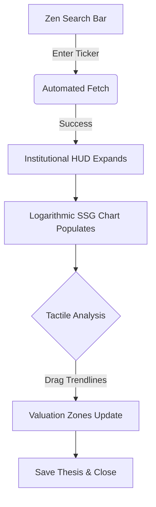
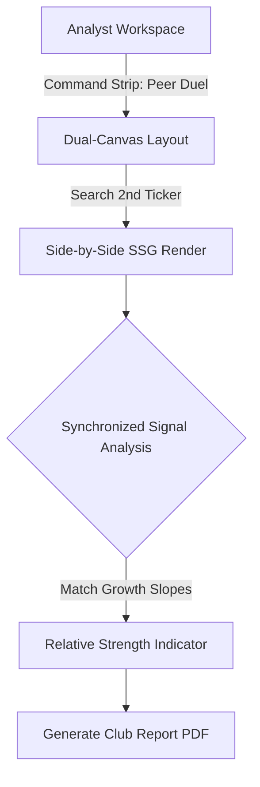

# UX Design Specification naic

**Author:** Guy
**Date:** 2026-02-04

---

## Executive Summary

### Project Vision

**naic** is an open-source, international investment analysis platform designed to automate the NAIC Stock Selection Guide (SSG) methodology. The project aims to eliminate the "manual entry tax" for Swiss, German, and US markets, transforming the analyst's workflow from data transcription to high-level decision-making through a "One-Click History" experience and interactive logarithmic charting.

### Target Users

* **Primary (Markus - The Value Hunter)**: Experienced or beginner analysts who research 5–20 stocks per week. They need to save time and ensure data accuracy for non-US markets.
* **Secondary (Elena - The Club Moderator)**: Investment club members who require standardized, professional-grade reports for collaborative analysis.
* *Admin (David - The Data Steward)*: Monitors the data engine's health to ensure continuous, reliable automation.

### Key Design Challenges

* **Density vs. Clarity**: Balancing high-density financial ratios with a clean, "Zen" interface that avoids overwhelming the user.
* **Tactile Charting**: Delivering a highly interactive, logarithmic projection tool in a web-native (WASM) environment that feels responsive and intuitive.
* **Contextual Complexity**: Clearly signaling currency normalization and accounting standard differences (IFRS vs. GAAP) across international borders.

### Design Opportunities

* **The "Aha!" Moment**: Instantaneous population of a 10-year growth chart from a single ticker entry, providing immediate value.
* **Projection Shadows**: Using ghosted historical slopes as a visual anchor when users make future growth projections.
* **The Command Strip**: A persistent, slim sidebar to anchor the "Analyst Workflow" during multi-step research sessions.

## Core User Experience

### Defining Experience

The primary loop of **naic** is the "Automated Analysis Cycle": Search → One-Click Populate → Kinetic Manipulation → Growth Decision. The experience is defined by the reduction of friction between seeing a ticker and understanding its 10-year growth story.

### Platform Strategy

A web-native SPA built with Rust (Leptos) for high-performance WASM charting. While primarily used on desktops for deep work, it utilizes responsive layouts to support tablet-based "review" sessions.

### Effortless Interactions

* **Ticker Autocomplete**: Fast, global ticker discovery that predicts exchange and currency.
* **Auto-Split Adjustment**: Historical prices adjust transparently behind the scenes.
* **Currency Mirroring**: Benchmarking two stocks in different currencies automatically normalizes both to the user's preferred viewing currency.

### Critical Success Moments

* **Instant Render**: The 10-year chart appearing in <2s of the first search.
* **Thesis Locking**: The satisfying "click" of saving an analysis note alongside the visual chart.

### Experience Principles

* **Analyst First**: Every design decision prioritizes the clarity of the trend over decorative flair.
* **Data Integrity as a Feature**: Visual flags (like "Data Gaps") build trust through transparency.
* **Interactive Empowerment**: Users "nudging" projections rather than typing numbers.

## Desired Emotional Response

### Primary Emotional Goals

The product must evoke **Confidence** in the data/methodology and **Calm** during the high-density analysis process. We want users to feel **Empowered** by the speed of automation and **Delighted** by the tactile nature of the charting.

### Emotional Journey Mapping

* **Search**: High focus/minimalist entry (Anticipation).
* **Initial Population**: Moment of delight (Speed and Ease).
* **Analysis/Manipulation**: Tactical flow, clarity, and empowerment.
* **Thesis Locking**: Satisfaction and a sense of professional accomplishment.

### Micro-Emotions

* **Confidence over Confusion**: Guided "JIT" (Just-In-Time) coaching for complex ratios.
* **Trust over Skepticism**: Explicit integrity flags for missing or split-adjusted data.
* **Pride over Utility**: Generating report outputs that look professional enough to present to the "Expert" tier or investment club.

### Design Implications

* **Trust** → Transparent "Data Source" footnotes and split-adjustment indicators.
* **Clarity** → A "HUD" (Heads-Up Display) approach where only the most relevant data for the current step is emphasized.
* **Empowerment** → Keyboard shortcuts and the persistent "Command Strip" for power users to navigate rapidly.

### Emotional Design Principles

* **Stay Out of the Way**: Design for speed; every pixel must earn its right to exist.
* **Precision as Comfort**: Sharp lines, consistent grids, and high-quality typography echo the discipline of the methodology.
* **Tactile Truth**: Allow users to "touch" the data through dragging trendlines to build an intuitive mental model of the company's growth story.

## UX Pattern Analysis & Inspiration

### Inspiring Products Analysis

The design will blend the **Zen-like focus of Todoist** (for the search and entry phase) with the **high-density structural integrity of Jira** and the **authoritative, data-first approach of the Bloomberg Terminal**.

* **Todoist**: Taught us the power of a "Zen" starting state and progressive disclosure to protect user focus.
* **Jira**: Demonstrated how to organize high-density metadata into collapsible sidebars and structured grids.
* **Bloomberg Terminal**: Provided the template for institutional authority, using high-precision typography and "Monochromatic + Neon" color schemes for maximum legibility.

### Transferable UX Patterns

* **Command Strip (Navigation)**: A slim, persistent vertical sidebar for quick navigation between research stages.
* **Zen-to-Power Transition**: A UI that evolves from a minimalist input to a high-density dashboard, mimicking the analyst's journey from inquiry to insight.
* **High-Density Grids**: Lean, data-dense tables for 10-year historical ratios, using monospace typography for numerical alignment.

### Anti-Patterns to Avoid

* **The "Padding Trap"**: Excessive whitespace that forces unnecessary scrolling.
* **Ambiguous Status**: Black-box calculations without transparent "Integrity Flags."
* **Consumer-Grade Softness**: Avoid bubbly gradients or excessive rounding that detracts from the professional, institutional feel.

### Design Inspiration Strategy

The strategy is **"Professional Zen."** We provide the raw density of a Bloomberg terminal, filtered through the focused interaction patterns of a modern productivity app. Every pixel must contribute to the "Growth Story" of the stock.

## Design System Foundation

### Design System Choice

**Custom Design System** (Vanilla CSS + Leptos Components).

### Rationale for Selection

* **Institutional Identity**: To achieve the "Bloomberg Terminal" level of authority and density, we need 100% control over the grid, typography, and "Neon" accents. Pre-built systems often carry too much "consumer-grade" padding and rounding.
* **Precision Charting**: A custom approach allows us to tightly integrate the visual design of the charts (Logarithmic scales, "Kinetic" dragging) with the overall workspace aesthetic.
* **Performance Optimization**: By avoiding large generic libraries, we keep the WASM bundle lean and ensure that the high-density financial tables render with maximum speed (the "Bloomberg speed" requirement).

### Implementation Approach

* **Tokens First**: Define a rigid set of design tokens (Color, Type, Spacing) in a global `index.css` before any component work starts.
* **WASM-Optimized Grids**: Utilize a bespoke grid system designed for high-density financial data, ensuring 10 years of historical ratios fit comfortably on a standard laptop screen.
* **Reactive Signals**: Every component will be built as a native Leptos component, using distributed signals for high-performance state management (e.g., updating valuation zones in real-time).

### Customization Strategy

* **Analyst Workbench HUD**: A persistent "Command Strip" and collapsible HUD panels built with sharp, non-rounded edges.
* **Data Integrity UI**: Custom-designed "Integrity Flags" and "Audit Footnotes" that blend seamlessly into the grid rather than appearing as disruptive pop-overs.
* **Logarithmic Visuals**: Specialized charting components that prioritize growth slopes over decorative curves.

## 2. Core User Experience

### 2.1 Defining Experience

The defining experience of **naic** is the **"Search-to-Insight" leap**. It transforms the user's workflow from manual data transcription to high-level analysis in a single step. By entering a ticker, the analyst instantly triggers a total shift in the interface—from a minimalist search entry to a high-density, institutional-grade workbench.

### 2.2 User Mental Model

We are moving the user from **"Transcription Mode"** (fragmented, slow, error-prone) to **"Pilot Mode"** (integrated, fast, empowering). The analyst should feel like the pilot of the data story, specifically focused on projecting future growth trends on the logarithmic chart rather than collecting historical figures.

### 2.3 Success Criteria

* **The 2-Second Rule**: The transition from search to an interactive, fully-populated 10-year chart must occur in under 2 seconds.
* **Zero-Click Normalization**: Absolute automation of currency conversions, market market-data splits, and accounting standard adjustments.
* **Tactile Trust**: Immediate (WASM-speed) visual feedback when manipulating charts, ensuring the user feels a direct physical connection to the valuation data.

### 2.4 Novel UX Patterns

* **Kinetic Charting**: A novel interaction where users "nudge" trendlines through direct manipulation to set buy/hold/sell zones, rather than typing numerical entries into a form.
* **The Command Strip**: A lean, persistent analyst-specific navigation pattern that allows rapid switching between peer-duels and portfolio contexts without losing analysis focus.

### 2.5 Experience Mechanics

1. **Initiation**: User interacts with a minimalist "Zen" search bar that predicts market and ticker.
2. **Interaction**: User enters ticker (e.g., `DAI.DE`).
3. **Feedback**: Fluid animation as the search bar shrinks and the high-density Analyst HUD expands. The logarithmic grid scales dynamically to fit the company's 10-year financial footprint.
4. **Completion**: The user locks their investment thesis with a "Save" action, transitioning the analysis into a permanent record with professional formatting for export or sharing.

## Visual Design Foundation

### Color System

The system uses an **"Institutional HUD"** scheme, prioritizing high-contrast legibility and a focused, calm workspace.

* **Background**: `#0F0F12` (Professional Deep Black) - Provides a stable, eye-friendly void.
* **Surfaces**: `#16161D` (Subtle Grey Layers) - Used for HUD panel depth and differentiation.
* **Primary Accent**: `#3B82F6` (Electric Blue) - Reserved for **"Interactive Core"** elements (trendlines, active HUD points).
* **Growth/Status**: `#10B981` (Emerald) - Used for success states and historical growth trendlines.
* **Integrity/Danger**: `#EF4444` (Crimson) - Dedicated to data integrity flags and audit warnings.

### Typography System

* **UI/Structural**: **Inter** (Clean, modern sans-serif) - Used for navigation and general interface labels.
* **Financial Data**: **JetBrains Mono** - A disciplined monospace face used for all numerical financial grids to ensure perfect vertical alignment and "soldier-like" readability.
* **Type Scale**: Compact and high-density, favoring the presentation of 10 years of data over decorative whitespace.

### Spacing & Layout Foundation

* **4px Precision Grid**: A rigid 4px base unit ensuring ultra-sharp alignment on high-DPI displays.
* **Analyst Workbench HUD**: A dense layout optimized for standard laptop screens (13-15"), ensuring that the central growth chart and supporting ratio tablets are visible simultaneously.
* **Progressive Disclosure Layers**: Using CSS-isolated depth layers to clearly distinguish between the "Command Strip" (nav), the "Workspace" (chart), and the "Detail HUD" (ratios).

### Accessibility Considerations

* **High Contrast**: All HUD elements maintain a minimum 7:1 contrast ratio against the deep black background.
* **Luminance Balancing**: Emerald and Crimson accents are tuned for luminance to prevent "color vibration" against the dark base.
* **Keyboard First**: Layout is structured to support rapid, non-mouse navigation via the "Command Strip."

## Design Direction Decision

### Design Directions Explored

We explored 6 distinct visual directions, ranging from minimalist "Zen" voids to data-dense terminal layouts. The primary goal was to find the optimal balance between high-density financial data and focused workflow navigation.

### Chosen Direction: Terminal Command Strip

The chosen direction is a hybrid of **The Command Strip (#3)** and **The Terminal Classic (#2)**.

### Design Rationale

* **Workflow Anchoring**: The "Command Strip" provides a persistent, vertical navigation anchor that allows the analyst to switch contexts (Peer Duel, Snapshot, Portfolio) without losing their place in the research flow.
* **Institutional Density**: The "Terminal Classic" grid system ensures that the 10-year historical ratios and CAGR calculations are presented with maximum efficiency, satisfying the "Bloomberg-level" requirement for power users.
* **Aesthetic Harmony**: This hybrid supports our "Professional Zen" goal by keeping the primary workspace (The Chart) central and focused, while providing high-density details in structured, persistent side-HUDs.

### Design Direction Implementation

* **Grid Framework**: A rigid, 4px-aligned central grid for the SSG chart, flanked by the slim Command Strip on the left and collapsible HUDs on the right.
* **Typographic Precision**: Unified use of JetBrains Mono for all data-dense grids to ensure perfect numerical alignment, combined with Inter for high-level navigation labels.
* **Signal-Driven Layout**: Use Leptos signals to dynamically adjust the density of the grid based on the user's focus (e.g., expanding ratio tables during "Audit Mode").

## User Journey Flows

### 3.1 The "Aha!" Discovery (Markus)

Entering a new ticker and moving from a minimalist search to a 10-year growth projection.



### 3.2 The Peer Duel (Elena)

Comparing two stocks side-by-side to prepare standardized club reports.



### 3.3 The Integrity Audit (David)

Reviewing and correcting anomalies in international market data.

```mermaid
graph TD
    A[Monitor Dashboard] -->|Blinking Crimson Flag| B[Integrity Alert HUD]
    B -->|Click Flag| C[Audit Footnote: "Possible Split Mismatch"]
    C --> D[Source Verification View]
    D -->|Manual Correction| E[Override Signal Locked]
    E --> F[System-wide Update]
```

### Journey Patterns

* **Navigation Pattern**: Use the **Command Strip** for mode-shifting (Discovery -> Comparison -> Portfolio).
* **Feedback Pattern**: Use **WASM-speed signals** for every interaction—eliminating loading spinners during the analysis phase.
* **Success Indicator**: The instant transformation of the workspace into the "Pilot Mode" state.

### Flow Optimization Principles

* **Minimizing Friction**: Automating market-data splits and currency mirroring to keep the analyst in the "flow."
* **Cognitive Loading**: Using progressive disclosure to reveal high-density data tables only when relevant to the current audit or analysis step.

## Component Strategy

### Design System Components

We will leverage the **Custom Design System** foundation to build a lean library of Leptos-native atoms:

* **Monospace Data Cell**: Optimized for JetBrains Mono, ensuring vertical alignment across 10-year tables.
* **Semantic Integrity Flag**: High-contrast, micro-indicators (Emerald/Crimson) for data source transparency.
* **Command Anchor**: Sharp-edged, minimal interaction points for the persistent "Command Strip."

### Custom Components

#### Kinetic SSG Chart

* **Purpose**: Central hub for growth analysis and future projections.
* **Usage**: Primary workspace for "Search-to-Insight" transformation.
* **Interaction**: Direct-manipulation trendlines. Dragging the growth handle triggers real-time valuation signal updates via WASM.

#### Financial Ratio Tablet

* **Purpose**: High-density display of historical performance and valuation metrics.
* **Anatomy**: Monospace grid with heat-mapped backgrounds for trend visualization and integrated audit footnotes.

#### Valuation Signal HUD

* **Purpose**: Real-time "Bottom Line" indicator showing Buy/Hold/Sell zones.
* **Behavior**: High-performance reactive display that shifts instantly based on chart manipulation.

### Component Implementation Strategy

* **Logic Isolation**: Every component is built as a pure Leptos signal consumer, decoupling visual presentation from the data engine's normalization logic.
* **4px Precision**: Rigid adherence to the 4px grid system at the component level to prevent layout shifts.
* **Accessibility First**: Built-in ARIA roles for complex financial charts and keyboard-navigable "Command Strip" anchors.

### Implementation Roadmap

* **Phase 1 (Core)**: SSG Chart + Ratio Tablet (The "Aha!" moment).
* **Phase 2 (Workflow)**: Command Strip + Search HUD.
* **Phase 3 (Depth)**: Peer Duel Canvas + Detailed Audit Footnotes.

## UX Consistency Patterns

### Button Hierarchy

* **Primary Action**: `#3B82F6` (Electric Blue) background, sharp 0px corners. Reserved for critical workflow locks (e.g., "Verify Audit").
* **Secondary Action**: Transparent background with a thin `#1F2937` border. Used for non-destructive panel toggles.
* **Ghost Action**: Text-only using the **Inter** typeface. Used for metadata exploration and secondary navigation.

### Feedback Patterns

* **The Signal System**: Uses semantic color glowing (Emerald for success, Crimson for integrity warnings) instead of modal popups.
* **Audit Alerts**: A pulsing 1px Crimson border indicates cells requiring analyst verification.
* **System Latency Indicator**: A persistent monospace footer showing system health ("Bloomberg Speed" indicator).

### Transition Patterns

* **The Zen Shrink**: Searching a ticker triggers a fluid collapse of the central search bar into a top-aligned HUD state.
* **Modular Expansion**: Side HUDs expand using sharp "Cut" transitions, maintaining a clinical, professional rhythm.

### Navigation Patterns

* **Workflow Anchoring**: The **Command Strip** remains the source of truth for location.
* **Zero-State Focus**: Minimalist entry paths that expand into high-density analysis states only upon successful data ingestion.

## Responsive Design & Accessibility

### Responsive Strategy

**naic** follows a **"Desktop-First Instrument"** strategy. Since the SSG methodology requires high-density information and simultaneous visualization of charts and ratio tables, the experience is optimized for desktop and tablet users over small-screen mobile devices.

* **Desktop**: Full "Institutional HUD" with persistent Command Strip and multi-column ratio tablets.
* **Tablet**: Command Strip collapses into a bottom navigation bar. Financial grids hide non-critical metrics to maintain touch-legibility.
* **Mobile**: Focused "Signal Summary" view. Users can see the primary SSG chart and valuation zones, but deep "Peer Duel" or "Integrity Audit" features are deprioritized or simplified.

### Breakpoint Strategy

* **Desktop (Wide)**: 1280px+ (Locked central grid with both side panels expanded).
* **Desktop (Standard)**: 1024px - 1279px (Command Strip persistent, side-HUDs collapsible).
* **Tablet**: 768px - 1023px (Touch-optimized interactions, bottom bar nav).
* **Mobile**: <767px (Single-column flow priority).

### Accessibility Strategy (WCAG AA)

* **Contrast**: 7:1 minimum contrast across all HUD elements against the deep black background.
* **Keyboard Parity**: 100% of the analysis workflow (Search -> Analysis -> Save) is navigable via keyboard without a mouse.
* **ARIA Customization**: Specialized ARIA labels for the logarithmic SSG chart to communicate growth slopes and valuation signals to screen readers.

### Testing Strategy

* **Institutional Burn-in**: Testing WASM render performance on a range of hardware (Intel/Apple silicon) to ensure the "2-Second Rule" is met.
* **A11y Audit**: Continuous automated accessibility scanning combined with manual keyboard-only verification rounds.

### Implementation Guidelines

* **WASM Performance Budget**: Target <100ms for chart re-renders to maintain the "Analyst Flow."
* **Relative Spacing**: Use `rem` for typography and `%` for grid columns to ensure fluid scaling within the rigid precision grid.

## Conclusion

The **naic** UX Design Specification is now complete. It provides a robust, "Institutional Zen" foundation for the development of an automated, international investment analysis instrument. Every design decision—from the 4px precision grid to the "Pilot Mode" user journeys—is engineered to remove the friction of manual data entry and empower the analyst's projection capabilities.

---
**Workflow Completed: 2026-02-04**
