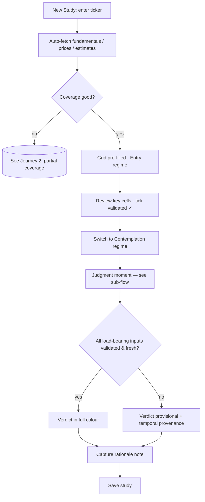
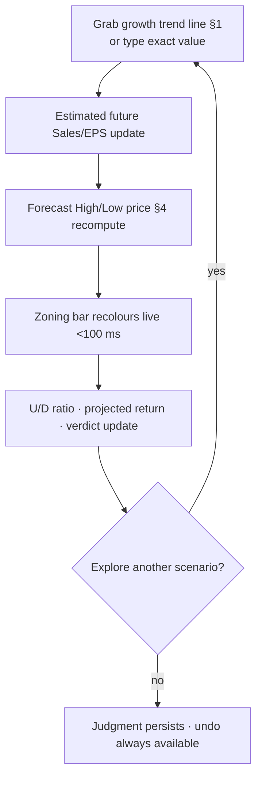
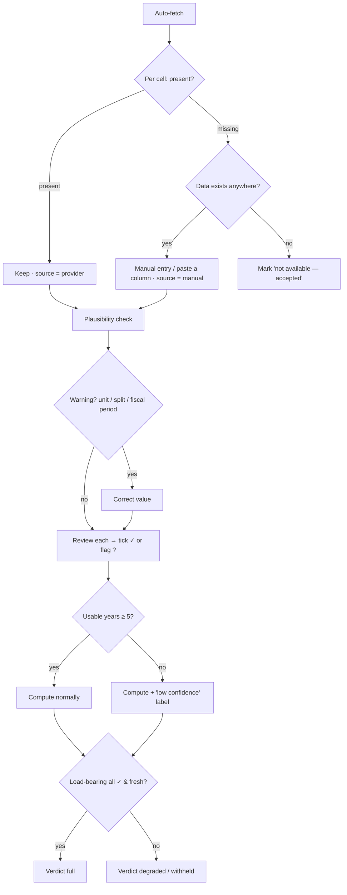
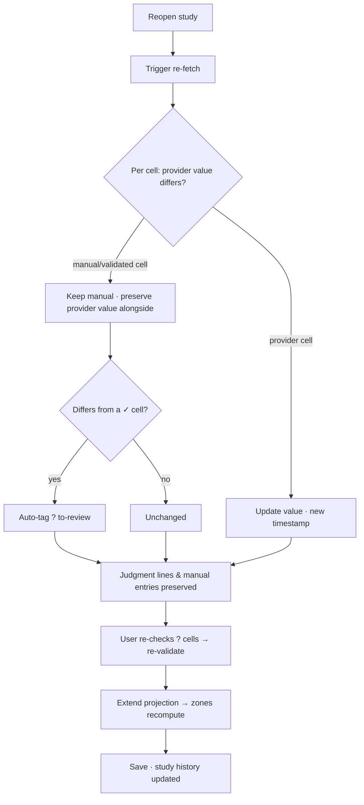
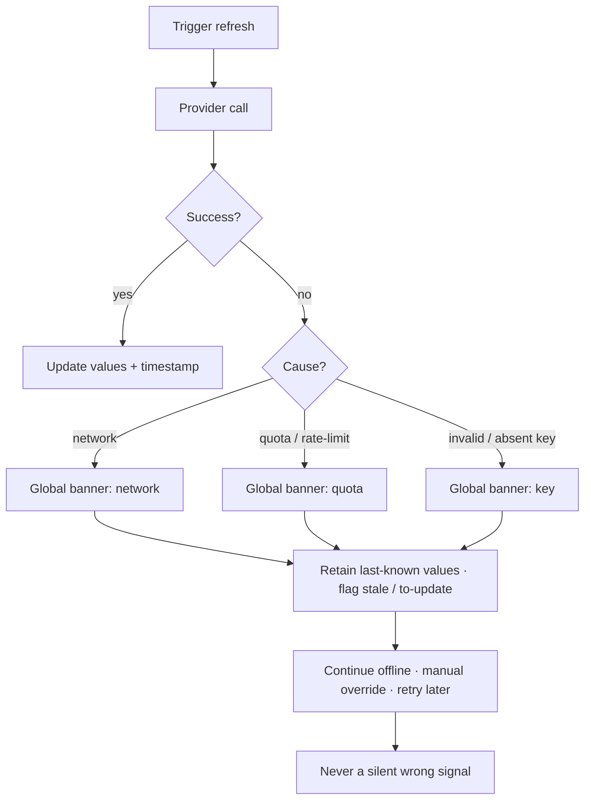
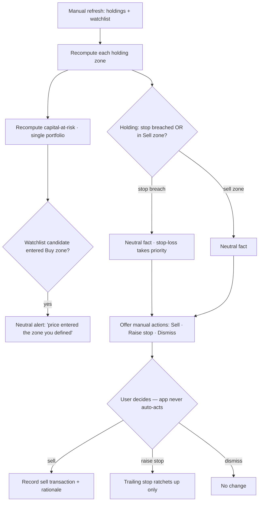
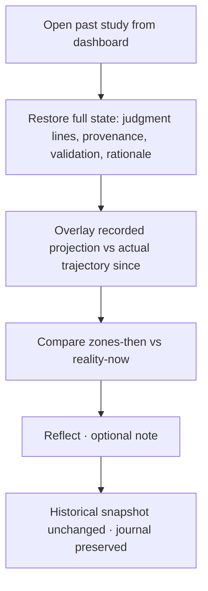

# UX Design Specification steadyinvest

**Author:** Guy
**Date:** 2026-06-06

---

<!-- UX design content will be appended sequentially through collaborative workflow steps -->

## Executive Summary

### Project Vision

steadyinvest is a personal, offline desktop instrument for **disciplined investment decisions**.
Its UX layers a live, interactive analytical experience on top of the familiar Stock Selection
Guide forms — **faithful enough that an expert is never disoriented**, modern enough that judgment
becomes fast and visual. The interface exists to **sharpen the user's own conviction**, never to
advise: it states facts, the user decides, and it keeps a revisitable memory of *why* each decision
was made.

### Target Users

- **Primary, and the only user in v1 — "Guy", the expert investor.** Knows the SSG method by heart;
  invests across CH/EU/US; has done studies by hand for years. High technical fluency; values
  **speed, ownership, keyboard efficiency, and information density** over hand-holding. Works in
  deliberate desktop sessions (Windows/macOS/Linux), at home — not on the go, not in a hurry to be
  taught.
- **Implications:** no beginner onboarding wizard; expert-grade precision and shortcuts;
  faithful-form familiarity over re-invention; trust and traceability over decoration.

### Key Design Challenges

1. **Two regimes, one truth.** A faithful *contemplation/judgment* grid and a high-throughput
   *entry/reconciliation* surface must share the same data and stay isomorphic — switching regimes
   without losing place or context.
2. **Provenance without noise.** Per-cell states (missing / to-fill / not-available-accepted /
   stale / validated / source) shown by an **attention hierarchy** — missing *shouts*, stale
   *murmurs*, auto-vs-manual revealed on demand — while **strong color stays reserved for the
   buy/hold/sell judgment zones** (no semantic collision).
3. **Expert-grade judgment lines.** Direct manipulation **and** exact-value entry, kept in sync,
   with **live (<~100 ms) recolor**, fully reversible (undo + scenario compare), and **never an
   auto-suggested line**.
4. **Faithful form + neutral, swappable labels + color-blind-safe zones.** Recognizable layout
   without NAIC marks; decision color encoded redundantly (not color-only).
5. **Visible trust.** Low-confidence (<5y), validated flags, plausibility warnings and the verdict's
   degraded/withheld presentation must make a *silent wrong signal* impossible to trust by accident.
6. **Risk at a glance.** A single, honest **capital-at-risk** figure (v1: single portfolio).
7. **No wizard.** Progressive, non-blocking configuration, contextual help/glossary, and a read-only
   demo study in place of forced onboarding.
8. **Print/PDF fidelity** of the study form (neutral labels, no marks).

### Design Opportunities

- **The judgment journal as a place.** A navigable, revisitable space where a past study's
  projection is **overlaid on the security's real trajectory** — a genuine delight moment and a
  differentiator no subscription tool offers.
- **Signature interaction:** dragging a judgment line and watching zones **recolor live** — the
  product's defining gesture.
- **Honest data states as a calm visual language.** Turning patchy CH/EU coverage from a liability
  into a *trustworthy* experience (missing/stale/validated read at a glance).
- **A disciplined, fact-only voice.** Neutral microcopy ("the price entered the zone you defined")
  as a consistent, distinctive tone that reinforces the user-as-sole-decider posture.
- **Future:** the AI "clerk of memory" as a non-intrusive *margin voice* that interrogates the
  past, never steering the future.

## Core User Experience

### Defining Experience

The product's heartbeat is **the judgment moment**: on a study's growth/valuation chart, the user
**adjusts a judgment line and the buy/hold/sell zones recolor live**, the upside/downside ratio and
verdict updating under his hand. If this one interaction is fast, trustworthy and reversible,
everything else follows. It sits inside the core loop — *fill/verify data → judge → read risk →
decide → record* — repeated per study and revisited over time.

### Platform Strategy

- **Native desktop** (Rust + Slint), **Windows / macOS / Linux**, single codebase.
- **Mouse + heavy keyboard**; not touch-optimized (deliberate desk sessions, not mobile).
- **Offline-first:** every core task works with no network; the only online action is a
  user-initiated refresh.
- **Local ownership:** OS secret store for keys, a single portable journal file, OS-locale-aware
  number formats; print/PDF of the study form.
- **Information-dense** layouts are welcome (expert user); no responsive/mobile compromise.

### Effortless Interactions

- **Auto-fetch pre-fills** the familiar grid — zero manual work when coverage is good.
- **Drag a judgment line → zones recolor instantly** (no "Calculate" button; recompute is implicit
  on any change).
- **High-throughput entry:** keyboard navigation and **paste a whole column of years** to fill CH/EU
  gaps.
- **Reopen a study → full state restored instantly** (judgment, provenance, rationale).
- **One manual refresh** recomputes all zones, risk and freshness in a single action.
- **Regime switch** (contemplation ↔ entry) preserves place and context.
- **Automatic, invisible housekeeping:** source/provenance/timestamp stamping, stale flagging on a
  failed fetch, validated-flag reset on a changed cell.

### Critical Success Moments

- **A trustworthy verdict in minutes** on a well-covered name → "this is faster than my spreadsheet."
- **Completing a CH/EU study despite gaps**, via fluid manual entry → "it still works on *my* market."
- **The live recolor** while dragging a line → "this is genuinely better."
- **Reopening a two-year-old study** and seeing exactly *why* he decided → the journal pays off.
- **One honest capital-at-risk figure** after a refresh → risk understood at a glance.
- **Make-or-break failures to prevent:** a *silent wrong signal* (trust is destroyed permanently);
  laggy/janky line dragging; manual entry so painful he retreats to Excel.

### Experience Principles

1. **Familiar first.** The form is home; the augmentation (charts, color, live recalc) sits *on
   top*, never replaces the recognizable structure.
2. **Live & direct.** Judgment is manipulated by hand with instant feedback — no modal "calculate"
   step ever.
3. **Honest by default.** Every number shows its source and freshness; uncertainty (low-confidence,
   stale, unvalidated) is *visible*, never hidden.
4. **Facts, not advice.** The app informs; the user decides. No suggested lines, no recommendations.
5. **Expert-respecting.** Density, keyboard, precision; zero hand-holding; nothing blocks the
   expert's flow.
6. **Calm.** Strong color is reserved for the judgment zones; provenance speaks softly — the paper
   form's calm is preserved.
7. **Durable memory.** Nothing is throwaway; the reasoning behind each decision is captured and
   revisitable.

## Desired Emotional Response

### Primary Emotional Goals

- **Confident control.** The user feels *in command of his own judgment* — the tool amplifies his
  reasoning, never substitutes for it. He owns every decision and feels the weight (and pride) of it.
- **Trustworthy calm.** A quiet certainty that the numbers are honest: what's solid looks solid,
  what's uncertain says so. No hidden surprises, no silent errors — peace of mind by transparency.

### Emotional Journey Mapping

- **First encounter:** *recognition, not learning.* An expert opens it and feels at home — "I know
  this form" — relieved he won't be re-taught.
- **During the core action (judging):** *flow and mastery.* Dragging a line, zones recoloring under
  his hand — direct, responsive, a little exhilarating; he feels skilled, not slowed.
- **Filling gaps (CH/EU):** *capable, not stuck.* Even with patchy data he feels the tool bends to
  him; honest gaps feel manageable, not like failure.
- **Completing a study:** *earned conviction.* Not "the app told me" but "I reached a judgment I can
  stand behind."
- **When something goes wrong (provider down, thin history):** *informed, never alarmed.* A calm,
  honest "this is stale / low-confidence" — he stays in control, trust intact.
- **Returning (months later):** *continuity and self-knowledge.* Reopening an old study, he feels a
  thread to his past self — sometimes humbled, always wiser.

### Micro-Emotions

- **Trust over skepticism** — the make-or-break emotion; a single silent wrong signal would convert
  trust into permanent doubt.
- **Confidence over confusion** — familiarity + clarity of state.
- **Accomplishment over frustration** — especially through manual entry friction.
- **Calm focus over anxiety** — a quiet surface; alarm reserved for what truly needs action.
- **Ownership/sovereignty over dependence** — "this is mine," not "I rent this."

### Design Implications

- **Trustworthy calm →** honest data states (missing/stale/validated/low-confidence) always visible;
  the verdict visibly degrades when inputs are weak; strong color reserved for judgment, not chrome.
- **Confident control →** no suggested lines, no recommendations; fact-only microcopy; the user's
  inputs and judgments are never overwritten or auto-moved.
- **Flow and mastery →** sub-100 ms live recalc, keyboard-first, undo everywhere; zero modal
  "calculate" friction.
- **Capable, not stuck →** gaps invite filling rather than block; paste-a-column entry; manual path
  always available.
- **Continuity →** durable, reopenable studies with projection-vs-reality overlay; rationale
  captured as a first-class artifact.
- **Avoid:** patronizing guidance, noisy dashboards, blocking dialogs, cheerful gamification, or any
  tone that implies the app knows better than the user.

### Emotional Design Principles

1. **Earn trust every screen** — visible honesty beats reassuring polish.
2. **Respect the expert** — speed, density and precision communicate respect.
3. **Calm by default, loud only when it matters** — attention is a scarce, deliberate resource.
4. **The user is the author** — pride comes from owning the judgment; the app never claims it.
5. **Continuity is comfort** — the sense of a durable, personal record is itself reassuring.

## UX Pattern Analysis & Inspiration

### Inspiring Products Analysis

- **Excel — entry gold standard.** Instant inline editing, pure keyboard navigation, **paste a
  whole column**, live recompute, total control, dense yet legible → the benchmark for the
  entry/reconciliation regime.
- **The legacy SSG forms — keep the recognizable appearance, modernize the look.** The user wants
  the forms to **stay recognizably the SSG form** (familiar appearance, not just abstract topology):
  same layout, sections, columns, field order *and* the form's visual identity. We **modernize the
  look** — flatter, cleaner, modern typography, calmer spacing, neutral labels — while staying within
  IP limits (no NAIC marks/logos or verbatim instructional text; functional layout is reproducible).
- **Typical financial tools — the cautionary reference.** Overloaded. The user wants the opposite:
  **clean, minimal, only-necessary-information**, plus **simple, logical, intuitive navigation with
  contextual help**.

### Minimalism, Defined

Minimalism here is **visual discipline, not whitespace**. *Dense ≠ cluttered*: cluttered = many
competing element **types**; dense = many regular **instances** of one type (read as a single
texture). So: **keep data density, remove component density** — zero decorative chrome; one type
family + two weights + right-aligned tabular figures; chromatic silence by default; hierarchy by
**contrast, not addition** (95% of the screen calm so the 5% that matters is audible).
*Reconciliation:* the recognizable NAIC form appearance is preserved; "minimalism" applies to
**styling** (remove dated chrome/clutter, calm the surface) — not to the form's structure or identity.

### Visual Hierarchy (the 3-second rule)

1. **Verdict first** — the buy/hold/sell zones on the chart own the screen's color; ticker/name
   beside them in sober black.
2. **Judgment lines & curves second** — thick, dark; the zones are décor, the curve is the actor.
3. **The 10-year grid third** — dark grey, right-aligned, tabular figures, ~2% zebra or whitespace
   separation, **no aggressive gridlines**.

**Color budget (monastic):** saturated color = the three zones, full stop; everything else
greyscale — *rarity creates the signal*. Color-blind-safe via **luminosity + vertical position + a
text label (BUY/HOLD/SELL)**, never red/green alone.

**Provenance as texture, never color:** validated = **nothing** (full opacity, the default); stale =
~60% opacity + a hollow dot / slight italic (a murmur); missing = a **bold neutral glyph** (thick
`—` or diagonal hatch) — a hole in a regular grid shouts on its own. Three textures, zero color
spent.

### Two Regimes (different yet isomorphic)

Same skeleton and coordinates (years in columns, metrics in rows), same order — the expert's spatial
memory holds in both. **Entry/reconciliation** = "pen" mode (ink, spreadsheet-fast editing, judgment
color muted). **Contemplation/judgment** = "verdict" mode (one notch more open, trends + zones to the
foreground, color lights up). Switching is a **reversible change of mood on the same structure**,
never a new page. In contemplation, **data and chart sit side-by-side in one window** (wide screens);
**dragging a judgment line recolors the zones in real time under the curve** — the signature moment.

### UI Language, Theme & Recognizability

- **UI language:** **French at launch**; the app is built **i18n-ready** so additional languages
  can be added later. (UI language is a separate axis from the NAIC↔neutral *label* set.)
- **Theme:** **dark by default, light/dark switchable** — suited to long expert desk sessions.
- **Recognizability test (guardrail):** a familiar user must recognize the SSG form **at a glance**,
  even visibly cleaner. Keep the **silhouette** (blocks, year columns, section order); modernize the
  **matter** (borders → alignment/light separators, flats, modern type). If a modernization makes the
  form unrecognizable, it has gone too far.

### Navigation & Contextual Help

- **Simple, logical, intuitive navigation** — a small, predictable set of places (studies, watchlist,
  portfolio, settings); the expert finds everything without a manual.
- **Contextual, non-blocking help / glossary** in place of an onboarding wizard — SSG terms and state
  codes explained on demand (hover/focus), never interrupting flow; a read-only demo study to learn by.

### Transferable UX Patterns

- Spreadsheet-grade grid (keyboard nav, paste-a-column, inline edit, implicit live recompute).
- Familiar SSG section/column layout (recognizable appearance preserved).
- Progressive disclosure — essentials + verdict always visible; provenance, detail, history on demand.
- Growth chart on a **semi-logarithmic scale** — part of the SSG method (the "up, straight &
  parallel" read), and it greatly simplifies trend estimation; valuation chart with the draggable
  judgment lines + real-time zone recolor.

### Anti-Patterns to Avoid

- Red/green arrows on every up/down number (drowns the only color signal that matters).
- Bordered cells everywhere; decorative bold; per-row colored backgrounds (anxiety rainbow).
- Multicolored provenance badges (burns the color budget on metadata).
- Always-on tooltips; modal "calculate" steps; setup wizards; any element that doesn't earn its place.

### Design Inspiration Strategy

- **Adopt:** spreadsheet-fast entry; the familiar SSG topology; a clean, minimal, color-disciplined
  surface; simple navigation + contextual help.
- **Adapt:** the SSG form **kept recognizable but modernized** — same layout/appearance, refreshed
  styling (flat, clean type, calm spacing), neutral labels; progressive disclosure to stay
  uncluttered.
- **Avoid:** financial-tool clutter, decorative density, color outside the judgment zones.

### Feasibility Note (forward to Architecture)

Grid = **custom on Slint** (Rust `TableModel` + virtualized `ListView`; cell-cursor keyboard nav,
inline edit, paste-a-column). Chart = **egui behind a `ChartView` trait**, composited **side-by-side
in the Slint window** (confirmed: same window, wide screens). **Week-1 spikes:** (A) grid —
paste-a-column is the make-or-break test; (B) egui drag + real-time recolor — measure *perceived*
latency; (C) egui-in-Slint same-window compositing — the real de-risking. Exit: A✅+C✅ → Slint bet
holds, egui peripheral; C✗ → decide all-egui with less form fidelity.

## Design System Foundation

### Design System Choice

A **custom, token-based, minimal design system implemented natively in Slint** — there is no mature
third-party design system for Slint, and steadyinvest's needs (recognizable-but-modernized SSG
forms, monastic color budget, spreadsheet-grade density, dark/light theming, French-first i18n) are
specific and central. We define a small set of **design tokens** plus a **purpose-built component
library**, rather than adopting or heavily theming a generic web system.

### Aesthetic Direction

**Modern *and* minimal — never a dated/retro look.** The styling is resolutely contemporary (flat
surfaces, current desktop conventions, clean modern typography, generous-but-calm spacing). This
sits *with* the recognizability guardrail: the SSG form's **silhouette stays recognizable**, but its
**skin is unmistakably current** — no engraved frames, 3D buttons, or period textures of the legacy
tools.

### Rationale for Selection

- **No suitable off-the-shelf system for Slint** — adopting a web design system is not an option for
  a native Rust/Slint desktop app.
- **The aesthetic is the product.** Faithful-form recognizability, a modern minimal look, and color
  discipline (saturated color only in the judgment zones) are core differentiators — best owned,
  not borrowed.
- **Tokens make the variable parts cheap:** light/dark theme switch, density tuning, and the future
  NAIC↔neutral label layer and additional UI languages all become configuration, not rewrites.
- **Right-sized for a solo developer:** a *small* token set + a *few* bespoke components (the data
  grid and the chart are the only truly custom-heavy pieces) over Slint primitives, not a sprawling
  library.

### Implementation Approach

- **Design tokens** (as Slint global singletons, swappable for theming):
  - *Color:* a greyscale **ink scale** (text/structure) + **three judgment-zone hues** (buy/hold/sell),
    each color-blind-safe (distinguished by luminosity + position + label), with **dark (default)**
    and **light** variants.
  - *Typography:* one **modern** type family, **two weights**, **tabular/right-aligned figures**; a
    small type scale.
  - *Space & density:* a compact spacing scale; light separators (no heavy gridlines); flat
    elevation (no decorative shadows/3D).
  - *State textures:* validated = none; stale = ~60% opacity + hollow dot; missing = bold neutral
    glyph/hatch.
  - *Motion:* a single easing for live zone recolor (smooth, never flashing); minimal elsewhere.
- **i18n layer:** UI strings in a string table, **French first**, structured so further languages
  drop in later — kept **separate** from the NAIC↔neutral *label* set (two independent axes).
- **Theme switch:** light/dark by swapping the token set at runtime.

### Customization Strategy

- **Bespoke components (the custom-heavy core):** editable data-grid cell + virtualized grid;
  judgment-line chart (egui-backed behind a `ChartView` trait); zone legend; provenance/state
  markers; verdict badge with degraded/low-confidence states; freshness indicator; contextual
  help/glossary popover; empty & error states.
- **Restyled Slint primitives:** buttons, inputs, scroll/list views, dialogs — reused but styled via
  the tokens to the minimal, modern aesthetic (flat, calm, no chrome).
- **Governance:** components consume tokens only (no hard-coded colors/sizes), so a token change
  re-themes the whole app; the recognizability + modern-look guardrails (step 5) gate any restyle of
  the forms.

## Defining Interaction — The Judgment Moment

### Defining Experience

The interaction the user would describe to a peer: **"I grab the growth line, set where I think the
company is going, and the buy/hold/sell zones recolor live under my hand — I see instantly whether
today's price is a buy."** On the semi-log growth/valuation charts, the user **places judgment lines
by direct manipulation or exact value**, and the zones, upside/downside ratio, projected return and
verdict **recompute in real time**. Nail this one interaction — fast, honest, reversible — and the
rest of the product follows.

### User Mental Model

- The expert's model **is the pencil on the paper form**: he has always *drawn* the trend and the
  forecast lines by hand, then read the zones. Direct manipulation matches that ingrained gesture —
  the app simply makes the pencil live.
- **Current solution:** pencil + spreadsheet/calculator — accurate but static, tedious, no instant
  feedback; a changed assumption means recomputing by hand.
- **Expectation:** "I move the line, everything updates." Anything that inserts a *Calculate* step,
  or that moves the line *for* him, breaks the model.
- **Likely friction to avoid:** a laggy or imprecise drag; a line that snaps somewhere he didn't
  intend; losing a prior assumption when exploring a new one.

### Success Criteria

- **Live & instant:** zones/ratio/verdict recolor within ~100 ms of a drag — it feels like the data
  is liquid under the cursor.
- **Precise *and* fluid:** drag for intuition, type the exact value for rigor, always in sync.
- **Reversible & explorable:** undo; compare scenarios; moving a line never destroys a saved input.
- **Honest:** the verdict visibly degrades when inputs are unvalidated or history is thin — the user
  is never misled by a confident-looking but unsupported zone.
- **Never advised:** no suggested line, no "optimal" hint — the placement is always the user's.
- *Indicators:* he reaches a verdict in seconds of adjustment; he trusts the zone because he sees its
  inputs; he explores "what if" without fear of losing work.

### Novel UX Patterns

- **Mostly established patterns in a novel combination:** draggable chart lines (TradingView-like)
  + a spreadsheet-grade grid + the SSG method — individually familiar, so **near-zero user
  education** for an expert.
- **The genuinely distinctive layer is the *posture*, not the mechanic:** real-time recolor bound to
  a *neutral, never-suggesting* model, with an *honesty* overlay (validated/low-confidence/stale
  visibly shaping the verdict). The innovation is restraint — the line is always his.

### Experience Mechanics

1. **Initiation.** The user opens a study (auto-fetched and/or manually filled). The growth/valuation
   charts render on a **semi-log** scale with current data; judgment lines appear at his
   **previously-set** positions, or unset and awaiting him — **never auto-placed**.
2. **Interaction.** He grabs a judgment line (future growth slope, forecast high/low P/E, low-price
   method) and drags it — or types its exact value. The line tracks the value; the **zones recompute
   and recolor live** beneath the curve; the present-price marker shows which zone it sits in.
3. **Feedback.** Zones recolor with a single smooth easing (never a flash); the **U/D ratio, projected
   return and verdict badge update in real time**; if a load-bearing input is unvalidated or the
   study is low-confidence, the **verdict shows degraded/withheld**; provenance textures stay calm in
   the background.
4. **Completion.** The judgment **persists** with its provenance and an optional **rationale note**;
   the study carries its verdict. Nothing is auto-decided. The user can undo, compare scenarios, or
   act (record a buy, set a stop) — always by his own hand.

### The Per-Cell Review Tag (tri-state validation)

Borrowed from a tax-preparation tool the user relies on (Dr Tax), the binary "validated" flag is
**enriched into a three-state user tag** carried by every data cell — the primary, *visible* discipline
against the product's top risk (a plausible-but-wrong figure trusted silently):

- **`(none)` — untouched.** The default. No marker; the cell simply holds its value (or its
  coverage/freshness state). Carries no human sign-off.
- **`?` — *to review*.** A user-set "I entered this but I'm not certain — come back" marker. Fills a
  gap the model previously lacked: distinct from *to-fill* (no value yet) and from *stale* (freshness),
  it is a **personal worklist flag**. While any `?` remains, the study is not yet "swept clean."
- **`✓` — *validated*.** The user's explicit human sign-off after reviewing the figure.

**Soft lock.** A `✓` cell is **protected from editing**: to change it, the user first clears the `✓`
(one explicit gesture), which returns the cell to `?` (so its need-to-recheck status is preserved,
never silently blanked). This makes the sign-off *load-bearing* — it cannot be undone by an accidental
keystroke — at the cost of only one deliberate gesture. *(This supersedes the prior auto-reset
semantics in PRD FR20: editing no longer silently clears the flag; the user un-validates deliberately.
Track as an FR20 refinement when the issue tracker exists.)*

**Bulk unlock.** A study-level **"unlock all"** action (also scoped per **column/year** and per
**row/metric**), behind a confirmation, flips every `✓ → ?` rather than to `(none)` — turning a saved
study into a ready-made re-check worklist. This is the natural entry point for the **annual update**
journey (re-open → unlock all → re-fetch/edit → re-validate what actually moved).

**Reconciliation synergy.** On a provider refresh, when a fetched value **differs from a `✓`
(validated) cell**, the system neither overwrites silently (forbidden) nor keeps silently: it
**auto-tags the cell `?`** ("the provider now reports a different value — review"). The tri-state tag
thus becomes the shared language of non-destructive reconciliation.

**Display discipline (defers to Visual Foundation).** `?` is a quiet attention glyph; `✓` is a small,
discreet confirmation mark — its **exact colour is fixed in the Visual Foundation step** against the
chosen zone palette, so it never collides with the saturated buy/hold/sell colours (a `✓` in green is
only admissible if the zones are *not* green, which the colour-blind-safe palette likely guarantees).
The `✓` is **present in the entry/reconciliation regime** (it rewards verification) and **attenuates in
the contemplation regime**, where only the decision should speak. This sits inside the existing data-state
model — *source* (provider/manual/derived) × *freshness* (current/stale) × *review* (none/`?`/`✓`) — as
the human-judgment axis, kept legible by the attention hierarchy (missing shouts, stale murmurs, review
tags speak softly).

## Visual Design Foundation

### Guiding Principle — A Monastic Colour Budget

Saturated colour is spent *only* on the three judgment zones (the verdict). Everything else
lives on a neutral greyscale **ink scale**; trust/provenance state is carried by **shape, texture,
opacity, size and position — never by an extra hue**. Rarity makes the verdict the loudest thing
on screen. Three render targets: **dark (default)**, **light**, and a **print/grayscale profile**.

### Colour System

**Judgment-zone hues (Okabe-Ito, colour-blind-safe):**
- **Buy** — bluish green `#009E73`
- **Hold** — amber `#E69F00` (rendered *lighter* in value)
- **Sell** — vermillion `#D55E00` (rendered *deeper/darker* in value)

The amber/vermillion pair is too close in luminance to tell apart at a glance once translucent,
so Hold and Sell are pushed apart on the **value axis** (Hold lighter, Sell deeper) in addition to
hue — a third, redundant channel.

**Zone rendering — alpha is asymmetric per theme, plus a full-saturation edge.** Translucent fill
*subtracts* life on a near-black background, so a single alpha fails the 3-second rule:
- **Dark theme:** fill **32–40 %** alpha + a **1.5–2 px full-saturation edge stroke** on each zone
  boundary (the pure pigment lives on the arête; the mass sets the mood).
- **Light theme:** fill **15–18 %** alpha + the same edge stroke.
Redundant encoding everywhere = hue + value + vertical position (buy low → sell high) + the text
label (BUY/HOLD/SELL).

**Ink scale — dark (default):** bg `#0E0F12` · surface `#16181D` · surface-alt/zebra `#1C1F26`
· separator `#2A2E37` · text-high `#ECEEF2` · text-mid `#B8BDC7` · text-low `#8A8F98`.

**Ink scale — light:** bg `#FBFBFC` · surface `#FFFFFF` · surface-alt `#F4F5F7` · separator
`#E2E4E9` · text-high `#14161A` · text-mid `#3F454F` · text-low `#6B7280`.

**Print / grayscale profile.** Majority in greys; colour is reserved for the verdict zones **only
when a colour device is available**. Because a study may print on a B&W device, the verdict must
stay fully readable in **pure greyscale** — carried by value (luminosity) + vertical position +
the BUY/HOLD/SELL label. Colour is a bonus on the verdict, never its sole carrier.

**Negative & special values.** No colour ever encodes sign (consistent with the "no red/green
arrows on every number" anti-pattern). Negatives are shown by a leading minus `−`; **N/A**, **0**,
and **empty/to-fill** are three visually distinct states (a value, a marked gap, an unfilled cell).

**Error / alert register (without spending the budget).** A single **global banner**, common to
all pages, appears on error/alert and states a **neutral, factual** message that names the cause
(network / quota / invalid-or-absent key). Its *persistence and position* are the attention
mechanism — it relies on an icon + ink + placement, not on red/amber (those belong to the verdict).
Buy-zone and stop alerts use the same neutral, factual phrasing ("the price entered the zone *you*
defined").

### Verdict Integrity (the anti-silent-wrong-signal rule)

A wrong-but-plausible signal is born from a verdict computed over a *mix* of cell states. Therefore
the **full saturated zone colour / verdict badge is spent only when every load-bearing input is
validated (✓) and not stale.** Otherwise the verdict renders in a **provisional texture** (hatched
outline / neutral ink instead of a full band) and shows **temporal provenance** in caption
("computed from data of DD/MM"). Full colour = full confidence. *(Machine-checkable invariant,
forwarded to Architecture/QA below.)*

### State & Trust Markers

The per-cell **tri-state review tag** (`none` / `?` to-review / `✓` validated, with the soft lock
from the Defining-Interaction section) and the coverage/freshness states are rendered as follows:

- **Validated `✓`** — a solid check. In the **entry/reconciliation regime** it carries a single
  *geofenced, sanctioned* **desaturated ink-green** (≈ `#4A7C6F` — deliberately **not** the Buy
  green `#009E73`, and never co-present with the zone bands), plus a ~120 ms draw micro-animation
  (trace + 0.9→1.0 scale) so verification *feels* rewarding (the Dr-Tax check). In the
  **contemplation regime** it falls back to neutral ink and **attenuates** (opacity floor ~40 %,
  never 0).
- **To-review `?`** — a hollow question glyph, given a **second non-colour channel** (heavier
  outline / slightly larger) so it cannot be confused with the hollow stale-dot.
- **Missing** — a bold neutral glyph / diagonal hatch (a hole in a regular grid shouts).
- **Stale** — ~60 % opacity + a hollow dot / slight italic (a discreet murmur).
- **Source** (provider / manual / derived) — revealed on demand (hover/focus), not always-on.

**Asymmetric attenuation (a safety rule, not a style choice).** In contemplation, only the
*positive* marker (`✓`) may dim. The *negative* signals — `?`, stale, provider-divergent, missing —
**never attenuate**; they stay (or gain) salience at the exact point the verdict is read, so a
verdict cannot "speak alone" while a load-bearing input is non-green. A **conscious-override** path
lets the user explicitly accept a non-green input; the acceptance is **traced** (turning a silent
omission into a recorded decision).

### Typography System

- **UI text:** **Inter**, two weights (400 / 600).
- **Numeric cells:** a typeface with **tabular figures by default** (e.g. IBM Plex Sans / Source
  Sans / monospaced digits) — *not* Inter-via-`tnum`, whose OpenType-feature path is not a reliable
  contract in Slint (verify in a 30-min week-1 test). Numeric data uses an added **weight 500**
  (so the scale is **400 / 500 / 600**) — fine digits at 400 "shimmer" in dense dark columns.
- **Type scale (4 px-aligned):** verdict 28 · H2 18 · H3 15 · body/data 14 · caption 12. Numeric
  cells right-aligned, tabular.
- **Hierarchy inside the grid is carried by ink colour, not weight:** values in text-mid, units/
  labels in text-low; **letter-spacing kept in reserve for column headers only** (weight alone is
  invisible at 14 px).

### Spacing & Layout Foundation

- **Base unit 4 px** (scale 4 · 8 · 12 · 16 · 24 · 32 · 48).
- **Dense grid:** row height **28 px**; cell padding 4 v / 8 h; **zebra ~4 %** *or* a focus/hover
  **row-highlight** (the original 2 % is invisible on dark — pick one that actually guides the eye).
- **Active-cell cursor:** the cell under the keyboard cursor is **highlighted** (a brighter surface
  step + a crisp 1 px ink ring) — visible without spending colour; multi-cell selection (paste-a-
  column) uses the same highlight extended. Focus is always visibly located (NFR-U2).
- **Flat elevation:** panels delimited by a 1 px border / contrast step — no drop shadows / 3D.
- **Contemplation layout:** data grid and chart **side-by-side in one window** on wide screens.
- **Two token families** (so theming is cheap and jank-free): *colour/alpha* tokens (free to swap
  at any time — dark/light, recolor, regime delta) and *metric/typo* tokens (quasi-static; a
  re-layout is tolerated only on rare events such as a language or label-set change, **never during
  a drag**).

### Chart Visual Tokens

All chart colour stays for the zones; chart elements are differentiated by **weight / brightness /
dash**, in the ink scale:
- **Historical curve** — text-mid, medium stroke. *(Corrects the earlier "thick dark curve",
  written for light mode: on dark it inverts to light ink.)*
- **Projection (future)** — same ink, **dashed**, so real vs projected reads instantly.
- **Judgment lines** — text-high (brightest), thicker, with a **visible grip handle** and a
  **generous hit target (~±8–10 px)** wider than the drawn line (easy grab *and* precision); hover
  brightens the handle; grab/grabbing cursor.
- **Present-price marker** — a discreet reference (text-low, thin dotted) plus a clear indication of
  which zone the price falls in.
*(Detailed affordances finalised in the Design-Directions / Component steps.)*

### Two-Regime Visual Delta

The entry ↔ contemplation switch is **never a new screen**: same skeleton, same coordinates,
**constant geometry** (row height does not change → no re-layout/jank). The "one notch more open"
is carried by **four levers only, all in the colour/alpha token family** (instant swap):
1. **Zone intensity** — muted in entry → **full** in contemplation.
2. **Marker salience** — `✓`-green visible in entry → attenuated (≥40 %) in contemplation; `?` /
   stale / divergent stay salient in both.
3. **Surface emphasis** — grid-dominant in entry → **chart + zones dominant** in contemplation.
4. **Edit affordances** — cell cursor / edit handles visible in entry → dimmed in contemplation.
Same scene, different lighting — the literal expression of "two regimes, one truth".

### Accessibility Considerations

- **Decision never colour-only:** zones carry hue + value + vertical position + label (NFR-U1); the
  Okabe-Ito hues are deuteranopia/protanopia-safe; the **grayscale print profile** is the ultimate
  proof the verdict survives without colour.
- **Keyboard-first:** primary study/entry flows fully keyboard-operable, with an always-visible
  focus/active-cell indicator (NFR-U2).
- **Contrast:** text-high on bg targets WCAG AA in both themes; dense metadata (text-low) holds
  AA-large as the floor.
- **Marker confusability gate:** the 5 trust markers must reach ≥98 % correct identification with
  <2 % pairwise confusion at 14 px on the real dark background (snapshot / perceptual-distance
  tests block merge).
- **Locale-aware numerals** (decimal comma, thousands) — a formatting concern, independent of glyph.
- *Scope note:* a full public WCAG / Section-508 audit is out of scope for a single-user tool —
  revisit before any public release.

### Forward-Notes to Architecture / QA

- **Typography feasibility:** confirm tabular-by-default numeric font in Slint in week 1; do **not**
  depend on `font-feature-settings: "tnum"` over Inter.
- **Theming across the FFI:** the egui chart does not read Slint global singletons — themed tokens
  (zone colours, ink, label-set) must be **pushed Slint→egui on theme change**. Extend the week-1
  charting spike (B) to render zone-band colour from a *pushed themed token*, not a hard-coded egui
  constant — de-risking cross-boundary theming alongside drag latency.
- **Trust invariants as quality gates (Murat):** `render(state).trustMarker == state.trustState`
  for every reachable state; `verdict.isFull ⟹ ∀ load-bearing input validated ∧ ¬stale`; a
  refresh injected during contemplation flips `✓→?` **and** degrades the verdict in the same
  coherence frame (no window where one moved and not the other); an ATDD test for the traced
  conscious-override path.

## Design Direction Decision

> An interactive mockup of the chosen direction lives at
> `_bmad-output/planning-artifacts/ux-stock-study-screen.html` (dark theme; collapsible sections;
> regime presets). It is a *direction* reference — details (exact grid, log scale, handles,
> persistence) are finalised in the Component-Strategy step, and the user expects further
> refinements once the real app is in use.

### Chosen Direction — Faithful collapsible SSG form as the primary screen

The Stock Study screen **is** the high-fidelity SSG form, with the five sections (§1–§5) rendered
top-to-bottom and **individually collapsible** to control scrolling. The earlier-explored layout
directions are folded in as facets, not separate screens:

- **App shell:** a left nav rail (Studies / Watchlist / Portfolio / Settings) + a top bar carrying
  the study identity, the **regime toggle** and expand/collapse-all controls.
- **Sticky verdict bar** (the essence of the "verdict rail" idea) pinned at the top of the scroll
  area: verdict, present price, projected return, appreciation, capital-at-risk — always visible
  while scrolling or folding.
- **The two regimes are expressed (partly) as fold presets** layered on the step-8 colour/marker
  delta: *Entry* = all sections expanded (work the data); *Contemplation* = §2/§3/§5 collapsed to
  their summary lines, **§1 growth chart + §4 zoning expanded** (judge).

### Key faithful-structure rules (locked)

- **High fidelity to the real SSG** (per [[high-fidelity-ssg-forms]]): functional layout, **visible
  cell grid**, lettered **A–H** columns with their formulas (A÷C, B÷C, F÷C, F÷B), the header +
  capitalization block, semi-log graph (1→200 axis, 5–30% growth-guide fan, year axis). Neutralise
  only the IP-protected expression (NAIC logo, wordmark/tagline, verbatim instructional prose,
  decorative marks); method labels stay and remain swappable. For the SSG forms, fidelity overrides
  the step-6 "remove borders" minimalism — the grid is part of the form's identity.
- **§1 growth chart carries NO buy/hold/sell zones** — it estimates the trend of Sales/EPS/Price
  (draggable growth trend lines). The **buy/hold/sell zoning is a separate §4 display**.
- **Single zoning display:** one **vertical zone bar** (Buy/Neutral/Sell thirds, the saturated
  colour, present-price marker) with a **price axis beside it** (368/292/216/141) — *not* duplicated
  as text rows; the §4C computation (range ÷ 3) stays in the calculation column for fidelity.
- **Collapsible sections** with an information-scent summary when collapsed (e.g. §3 → "PER moy 14.5
  · courant 14.7", §4 → "ACHAT · zone 141–216 · H/B 3.4:1"); **fold state is persisted** per study.
- **Print/PDF expands every section** (full faithful form), grayscale-safe per step 8.

### Design Rationale

- It is the **most complete** view and the one an SSG expert recognises instantly — adoption depends
  on close resemblance (the user insists on it).
- Collapsibility resolves the only real downside of a faithful vertical form (scrolling) without
  sacrificing fidelity, and doubles as the regime mechanism.
- The sticky verdict bar preserves decision legibility (3-second rule) despite the long form.
- A single zoning display removes redundancy while the price axis keeps exact ranges readable.

### Implementation Approach

- One scrollable **faithful form** = app nav rail + top bar (identity, regime, expand/collapse) +
  sticky verdict bar + non-collapsible header + collapsible §1–§5.
- Collapsible section = a reusable component; fold presets bound to the regime control; the print
  path forces all-expanded. Chart (egui) embedded in §1; the zoning bar in §4. Component-level
  detail (exact grid, log scale, judgment-line handles, fold-state persistence) is finalised in the
  Component-Strategy step.

## User Journey Flows

> Mechanics for the v1 (Phase 1) critical journeys from the PRD. All flows obey the locked posture:
> implicit recompute (no "Calculate" button), neutral facts (never auto-acts), honest degradation
> (stale / low-confidence / provisional always visible), and reversibility (undo; manual & judgment
> never destroyed).

### Journey 1 — New Stock Study, good coverage (+ the judgment moment)

```mermaid
flowchart TD
  A[New Study: enter ticker] --> B[Auto-fetch fundamentals / prices / estimates]
  B --> C{Coverage good?}
  C -- no --> M[(See Journey 2: partial coverage)]
  C -- yes --> D[Grid pre-filled · Entry regime]
  D --> E[Review key cells · tick validated ✓]
  E --> F[Switch to Contemplation regime]
  F --> G[[Judgment moment — see sub-flow]]
  G --> H{All load-bearing inputs validated & fresh?}
  H -- yes --> I[Verdict in full colour]
  H -- no --> J[Verdict provisional + temporal provenance]
  I --> K[Capture rationale note]
  J --> K
  K --> L[Save study]
```

**Sub-flow — the judgment moment (signature interaction):**

```mermaid
flowchart TD
  S[Grab growth trend line §1<br/>or type exact value] --> T[Estimated future Sales/EPS update]
  T --> U[Forecast High/Low price §4 recompute]
  U --> V[Zoning bar recolours live <100 ms]
  V --> W[U/D ratio · projected return · verdict update]
  W --> X{Explore another scenario?}
  X -- yes --> S
  X -- no --> Y[Judgment persists · undo always available]
```

### Journey 2 — CH/EU partial coverage + manual entry + validation

```mermaid
flowchart TD
  A[Auto-fetch] --> B{Per cell: present?}
  B -- present --> C[Keep · source = provider]
  B -- missing --> D{Data exists anywhere?}
  D -- yes --> E[Manual entry / paste a column · source = manual]
  D -- no --> F[Mark 'not available — accepted']
  C --> G[Plausibility check]
  E --> G
  G --> H{Warning? unit / split / fiscal period}
  H -- yes --> I[Correct value]
  H -- no --> J[Review each → tick ✓ or flag ?]
  I --> J
  J --> K{Usable years ≥ 5?}
  K -- yes --> L[Compute normally]
  K -- no --> N[Compute + 'low confidence' label]
  L --> O{Load-bearing all ✓ & fresh?}
  N --> O
  O -- yes --> P[Verdict full]
  O -- no --> Q[Verdict degraded / withheld]
```

### Journey 2b — Annual update / reconciliation

```mermaid
flowchart TD
  A[Reopen study] --> B[Trigger re-fetch]
  B --> C{Per cell: provider value differs?}
  C -- manual/validated cell --> D[Keep manual · preserve provider value alongside]
  D --> E{Differs from a ✓ cell?}
  E -- yes --> F[Auto-tag ? to-review]
  E -- no --> G[Unchanged]
  C -- provider cell --> H[Update value · new timestamp]
  F --> I[Judgment lines & manual entries preserved]
  G --> I
  H --> I
  I --> J[User re-checks ? cells → re-validate]
  J --> K[Extend projection → zones recompute]
  K --> L[Save · study history updated]
```

### Journey 3b — Provider failure (error path)

```mermaid
flowchart TD
  A[Trigger refresh] --> B[Provider call]
  B --> C{Success?}
  C -- yes --> D[Update values + timestamp]
  C -- no --> E{Cause?}
  E -- network --> F[Global banner: network]
  E -- quota / rate-limit --> G[Global banner: quota]
  E -- invalid / absent key --> H[Global banner: key]
  F --> I[Retain last-known values · flag stale / to-update]
  G --> I
  H --> I
  I --> J[Continue offline · manual override · retry later]
  J --> K[Never a silent wrong signal]
```

### Journey 3/4 (v1 slice) — Portfolio risk, neutral alerts, sell / raise-stop

```mermaid
flowchart TD
  A[Manual refresh: holdings + watchlist] --> B[Recompute each holding zone]
  B --> C[Recompute capital-at-risk · single portfolio]
  C --> D{Watchlist candidate entered Buy zone?}
  D -- yes --> E[Neutral alert: 'price entered the zone you defined']
  B --> G{Holding: stop breached OR in Sell zone?}
  G -- stop breach --> H[Neutral fact · stop-loss takes priority]
  G -- sell zone --> I[Neutral fact]
  H --> J[Offer manual actions: Sell · Raise stop · Dismiss]
  I --> J
  J --> K{User decides — app never auto-acts}
  K -- sell --> L[Record sell transaction + rationale]
  K -- raise stop --> N[Trailing stop ratchets up only]
  K -- dismiss --> O[No change]
```

### Journey 5 — Reopen & confront a past judgment

```mermaid
flowchart TD
  A[Open past study from dashboard] --> B[Restore full state: judgment lines, provenance, validation, rationale]
  B --> C[Overlay recorded projection vs actual trajectory since]
  C --> D[Compare zones-then vs reality-now]
  D --> E[Reflect · optional note]
  E --> F[Historical snapshot unchanged · journal preserved]
```

### Journey Patterns

- **Navigation:** nav rail (Studies / Watchlist / Portfolio / Settings) → study dashboard
  (list/search/sort/filter) → the one faithful study screen; regime toggle and collapsible sections
  are the in-screen navigation; the sticky verdict bar is the constant anchor.
- **Decision:** the app surfaces **neutral facts + manual actions**, never auto-acts; the
  **stop-loss takes priority** over the Sell zone; a non-green load-bearing input forces a **traced
  conscious-override**, never a silent omission.
- **Feedback:** implicit live recompute (<100 ms recolor, no Calculate button); attention hierarchy
  (missing shouts, stale murmurs, ✓ rewards in entry); **verdict integrity** (full colour only when
  load-bearing inputs are ✓ & fresh, else provisional); a single **global error banner** names the
  cause.
- **Data-state:** every cell = source (provider/manual/derived) × freshness (current/stale) ×
  review (none/?/✓); reconciliation is **non-destructive** (manual wins, provider preserved,
  divergence → auto-?).

### Flow Optimization Principles

- **Minimize steps to value:** auto-fetch pre-fills; no setup wizard; recompute is implicit on any
  change.
- **Reduce cognitive load:** progressive disclosure via collapsible sections with summary scent;
  contemplation preset folds the data-heavy sections.
- **Reversible & explorable:** undo everywhere; soft-lock on ✓; scenario compare on the judgment
  line; manual and judgment are never destroyed.
- **Honest by default:** low-confidence, stale and provisional states are always visible at the
  point the verdict is read.
- **Keyboard-first** across entry and judgment; the active cell is always visibly located.

## Component Strategy

### Design System Components (foundation — restyled Slint primitives via tokens)

Reused Slint primitives, styled to the minimal/modern aesthetic via the design tokens (no
hard-coded colours/sizes): buttons, text/number inputs, scroll & list views, dialogs, the
regime toggle (segmented control), tooltip/popover host, checkbox (the per-cell ✓). These carry no
domain logic — they consume the colour/alpha + metric/typo token families.

### Custom Components (the custom-heavy core)

1. **Data-grid + editable cell** — virtualized SSG tables (Rust `TableModel` + `ListView`):
   keyboard cell-cursor, **paste-a-column**, inline edit, visible cell grid (high-fidelity),
   right-aligned tabular figures. Per-cell: source (provider/manual/derived) · freshness
   (current/stale) · **tri-state review tag** (none/?/✓) with **soft-lock**. *States:* default,
   focused (active-cell cursor), editing, validated (locked), to-review, stale, missing, not-
   available-accepted, plausibility-warning.
2. **Collapsible SSG section** — `details/summary`-style with chevron, **summary-scent line when
   folded**, **persisted fold state**, bound to the **regime fold presets**. *States:* expanded /
   collapsed; print = force-expanded.
3. **Semi-log growth chart (§1)** — egui behind a `ChartView` trait: Sales/EPS/Price lines
   (historical solid / projected dashed), 5–30 % guide fan, year axis, 1→200 log axis,
   **draggable growth trend lines** (visible handle, ~±8–10 px hit target), **no zones**.
   *States:* idle, hover-handle, dragging, low-confidence overlay.
4. **Zone bar + price axis (§4)** — single vertical Buy/Neutral/Sell thirds with full-saturation
   edge strokes, present-price marker, side price axis; **recolours live (<100 ms)**. *States:*
   full vs muted (regime), provisional (when inputs unvalidated).
5. **Scenario-compare overlay** — compare two judgment-line placements (overlay or A/B) with their
   resulting zones/U-D/return side by side; **never destroys a saved input** (per the step-7 success
   criteria). Phase 1: one alternate scenario; richer multi-scenario compare in Phase 2.
6. **Verdict badge** — *States:* full colour / provisional (hatched + temporal provenance) /
   degraded / withheld.
7. **Sticky verdict bar** — verdict + present price + projected return + appreciation + capital-at-
   risk; pinned during scroll/fold.
8. **Trust/state markers** — ✓ (geofenced ink-green in entry, attenuated in contemplation), ?
   (hollow + 2nd non-colour channel), missing (bold glyph/hatch), stale (≈60 % + hollow dot),
   source-on-demand. **Confusability-gated** (≥98 % ID, <2 % pairwise at 14 px).
9. **Global error/alert banner** — neutral, names cause (network/quota/key); same register for
   buy-zone & stop alerts.
10. **Form header + capitalization block** — the faithful study-header fields.
11. **Calc-row (§4/§5)** — label · computation · boxed result (faithful formula display).
12. **State legend** (FR57) · **empty/error states** (FR58) · **contextual help/glossary popover +
    read-only demo study** (FR62).
13. **App nav rail + study dashboard** (list/search/sort/filter/archive — FR54/FR55).
14. **Portfolio set** — holdings register, capital-at-risk panel, trailing-stop control,
    sell/raise-stop action sheet (neutral), watchlist.
15. **Settings panels** (no wizard) — provider/key, reference currency, risk thresholds, label set
    (NAIC↔neutral), locale.

### Component Implementation Strategy

- **Tokens only:** every component reads the colour/alpha & metric/typo token families — a token
  swap re-themes the whole app (dark/light, regime, future label-set/i18n).
- **Chart across the FFI:** the egui `ChartView` receives **themed tokens pushed Slint→egui** on
  theme change (per step-8 forward-note); zone-band colour is a pushed token, not a constant.
- **Keyboard-first & accessible:** every entry/judgment component fully keyboard-operable; visible
  focus; decision never colour-only; markers pass the confusability gate.
- **Reuse:** the data-grid, collapsible section, trust markers, calc-row and zone bar are shared
  across study / portfolio / comparison surfaces.

### Implementation Roadmap

- **Phase 1 (MVP) — de-risk first via week-1 spikes:** (A) data-grid paste-a-column, (B) egui
  growth chart drag + live zone-bar recolor, (C) egui-in-Slint same-window compositing. Then:
  collapsible section, trust markers, verdict badge + sticky verdict bar, error banner, form
  header/calc-rows, study dashboard, nav rail, settings, legend/help/demo, single-portfolio risk +
  sell/raise-stop, minimal scenario-compare.
- **Phase 2 — supporting:** multi-portfolio + FX consolidation, transaction ledger, concentration,
  dividends, replacement-candidate surfacing, richer scenario-compare.
- **Phase 3 / Vision:** Company Comparison, Portfolio Health Review, screening, PDF/print refinements,
  the read-only AI "margin voice" component.

## UX Consistency Patterns

> Cross-cutting rules so every surface behaves predictably. They inherit the locked posture:
> monastic colour (feedback never borrows the zone hues), neutral facts (no advice verbs),
> keyboard-first, honest/visible states. This is a single-user desktop app — no mobile/responsive
> patterns (density is welcome; see the Responsive & Accessibility section for window-size behaviour).

### Button Hierarchy & Actions

- **One primary action per surface** (token-filled in ink, never a zone hue): e.g. *Save study*,
  *Refresh*. **Secondary** = outline/ghost; **tertiary** = text buttons (*Expand all*, *Show source*).
- **Destructive actions** (delete/archive a study, *Unlock all* ✓→?) require a **confirmation
  dialog**; treated in neutral ink, never red-on-everything.
- **Neutral labels:** factual verbs only (*Record sell*, *Raise stop*, *Mark validated*) — never an
  imperative recommendation (*Buy*, *Sell now*). Enforced against the banned-verb list.
- Every action is keyboard-reachable with a visible focus state.

### Feedback Patterns

- **Colour budget holds:** success/error/warning/info use **ink + icon + position**, not the
  buy/hold/sell hues.
- **Errors & outages →** the single **global banner**, naming the cause (network / quota / key).
- **Plausibility warnings →** inline at the cell, a neutral attention glyph (distinct from quality
  flags and from the review tag).
- **Success →** quiet and non-modal (a subtle state change / light confirmation); no cheerful
  gamification.
- **The live recolor (<100 ms) and the verdict full-vs-provisional state are themselves feedback** —
  the system answers every change immediately and honestly.

### Form / Data-entry Patterns

- **Inline editing** in the grid (Excel-like); **implicit recompute** on any change (no Calculate
  button); **paste-a-column**; keyboard cell-cursor navigation.
- **Locale-aware parsing** (decimal comma, thousands); negatives by sign `−`; **N/A ≠ 0 ≠ empty**.
- **Validation never blocks:** plausibility issues surface as warnings; missing is a normal visible
  state; the **tri-state review tag + soft-lock** govern sign-off; ✓ auto-resets / →? on change.
- No required-field modals, no setup wizard.

### Undo & Reversibility

- **Undo/redo is available everywhere** edits or judgments happen (grid edits, judgment-line moves,
  validation toggles); a moved judgment line **never destroys a saved input**.
- **Scenario compare** lets the user explore an alternative without committing or losing the prior
  placement.
- **Nothing destructive is silent:** delete/archive and *Unlock all* confirm first; reconciliation
  preserves the provider value alongside the manual one.

### Navigation Patterns

- **Persistent left nav rail:** Studies / Watchlist / Portfolio / Settings — a small, predictable
  set of places.
- **Study dashboard** (list/search/sort/filter/archive) → the one faithful study screen.
- **In-screen navigation** = regime toggle + collapsible sections + the **sticky verdict bar** as a
  constant anchor. The app is deliberately shallow (no deep breadcrumb trails).

### Overlay / Modal Patterns

- **Prefer inline & non-blocking:** contextual help/glossary as a **hover/focus popover**;
  sell/raise-stop as a neutral **action sheet**.
- **Modals reserved** for destructive confirmations and import/restore (with integrity + schema
  checks). Help never interrupts flow.

### Empty & Loading States

- Every main surface has an **actionable empty state** (FR58): no studies → *Create your first
  study* + a link to the **read-only demo study**.
- **Loading** (user-initiated fetch) shows progress **without blocking the UI**; **offline is a
  normal state**, not an error.

### Search & Filtering

- Dashboard search/sort/filter; watchlist add/edit/remove/reorder — all keyboard-accessible.

### Microcopy & Voice

- **Fact-only, neutral, calm:** "the price entered the zone *you* defined." No advice, no
  exclamation, no urgency. The **educational/not-advice disclaimer is always visible** (footer).

## Responsive Design & Accessibility

### Responsive Strategy (desktop window sizes, not devices)

Native desktop only (Windows/macOS/Linux); **no web, no mobile, not touch-optimized**. "Responsive"
means adapting to **window size on a desktop**, from a laptop to large/ultrawide monitors — density
is always welcome, never a mobile compromise.

- **Wide (≥ ~1440 px):** the contemplation ideal — room for the §1 chart and the sticky verdict bar
  to breathe; collapsible sections comfortable.
- **Comfortable (~1024–1440):** the chosen single-column faithful form (vertical scroll) is the
  baseline; §1 chart full-width within its section; verdict bar on one row.
- **Compact (< ~1024 / small window):** graceful reflow — header meta stacks to one column, the
  verdict bar wraps, the §1 quarterly inset may drop below the graph. **The §3 A–H table keeps its
  columns** (fidelity > reflow): horizontal scroll rather than breaking its structure.
- **Minimum window size enforced** so the faithful grid stays legible; **window size, fold state and
  regime are persisted**.

### Breakpoint Strategy

Not device breakpoints — two desktop layout thresholds: **compact** (single column, verdict bar
wraps, inset below graph) and **comfortable** (full side-by-side where a surface offers it). The
dense §3 table never collapses its columns; it scrolls horizontally if the window is too narrow.

### Accessibility Strategy (right-sized for a single expert user)

- **Scope:** practical **WCAG AA-ish** for the single user; a full public WCAG/Section-508 audit is
  out of scope (NFR-U) — **revisit before any public release**.
- **Decision never colour-only** (NFR-U1): hue + value + vertical position + label; Okabe-Ito
  colour-blind-safe; the grayscale-print profile is the proof.
- **Keyboard-first** (NFR-U2): full keyboard operation, always-visible focus/active-cell, logical
  tab order, shortcuts for frequent actions (refresh, validate, undo, regime toggle, fold), and a
  **keyboard quick-jump between sections §1–§5** (the form is long). The **judgment line is settable
  by exact value (keyboard), not only by drag** — the gesture+value duality keeps the chart
  non-mouse-only.
- **Contrast:** text-high meets AA in both themes; metadata holds AA-large as the floor.
- **Marker confusability gate** (≥98 % ID, <2 % pairwise at 14 px) — a CI quality gate.
- **Motion:** a single easing; **respect OS "reduced motion"** (disable the recolor / ✓ micro-
  animation when requested).
- **Text scaling:** respect OS font-scale via token-driven scalable sizing; nothing hard-locked.

### Testing Strategy

- **Cross-platform:** build & run on Windows/macOS/Linux; **identical numeric results** (NFR-X1).
- **Window-size:** laptop → ultrawide, minimum size, fold/regime persistence.
- **Colour-blind simulation** (deuteranopia/protanopia) on zones + markers; **grayscale print test**.
- **Keyboard-only** walkthrough of entry, judgment, and portfolio flows.
- **Confusability** snapshot/perceptual tests (<2 % pairwise) in CI (from the Visual Foundation).
- **Contrast** checks in both themes.

### Implementation Guidelines

- **Token-driven, scalable sizing**; respect OS locale (numbers), OS reduced-motion, OS font-scale;
  optional follow-OS-theme.
- **Slint accessibility properties** on interactive components; explicit focus management; never a
  colour-only signal.
- **Minimum-window constraint**; persist window/fold/regime state.
- **egui chart** exposes a keyboard/exact-value path for every judgment line (no mouse-only control).
